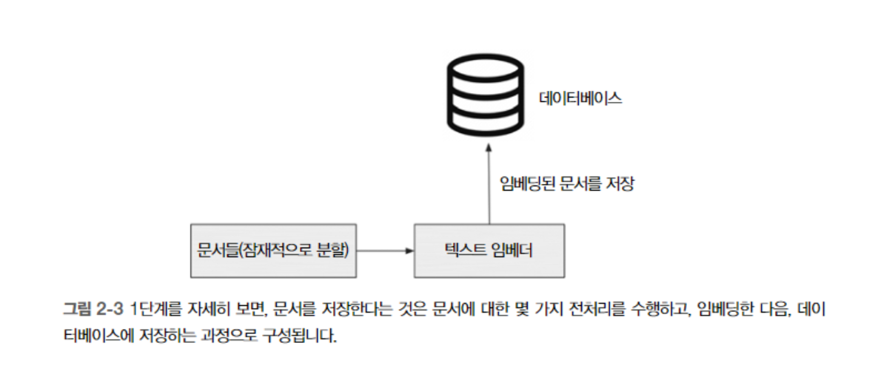
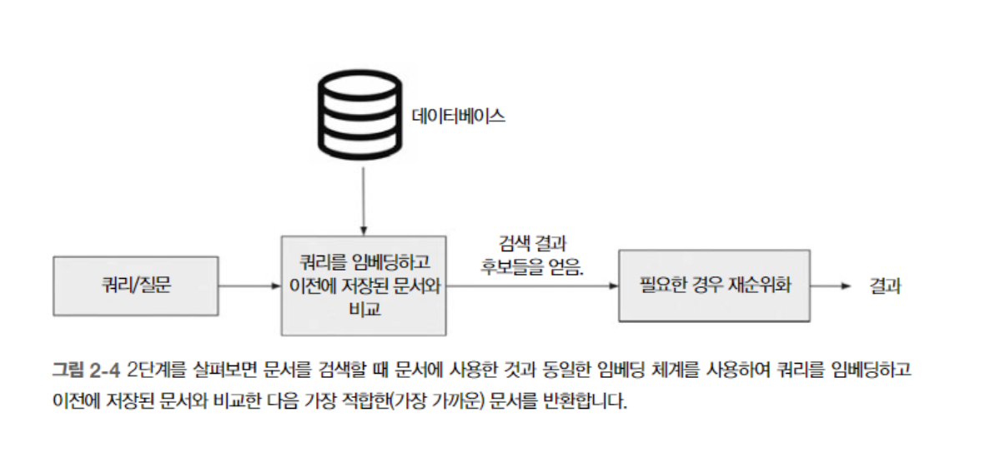
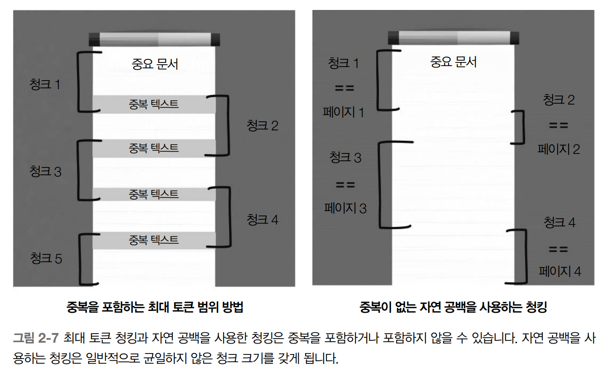
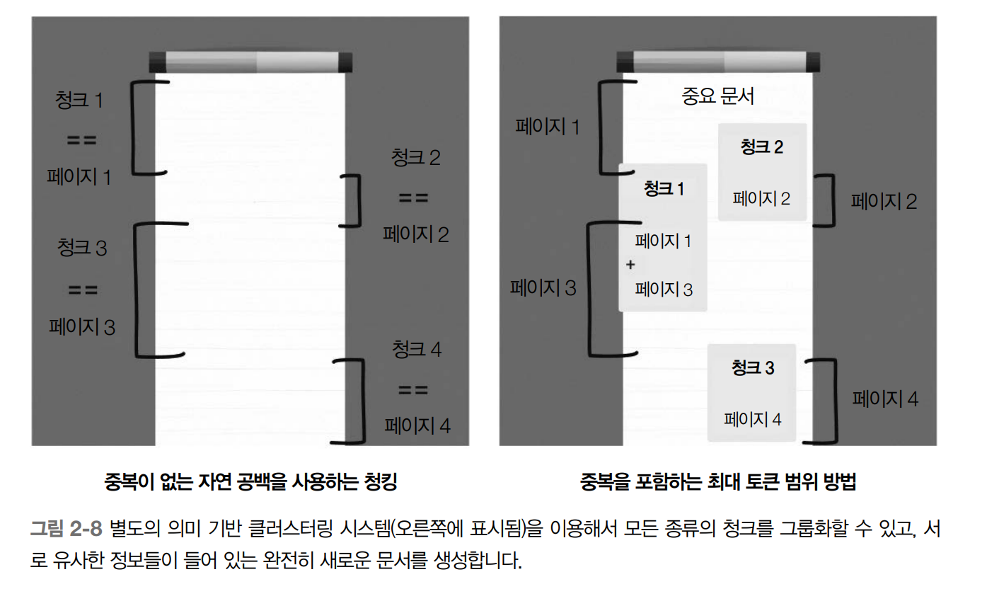
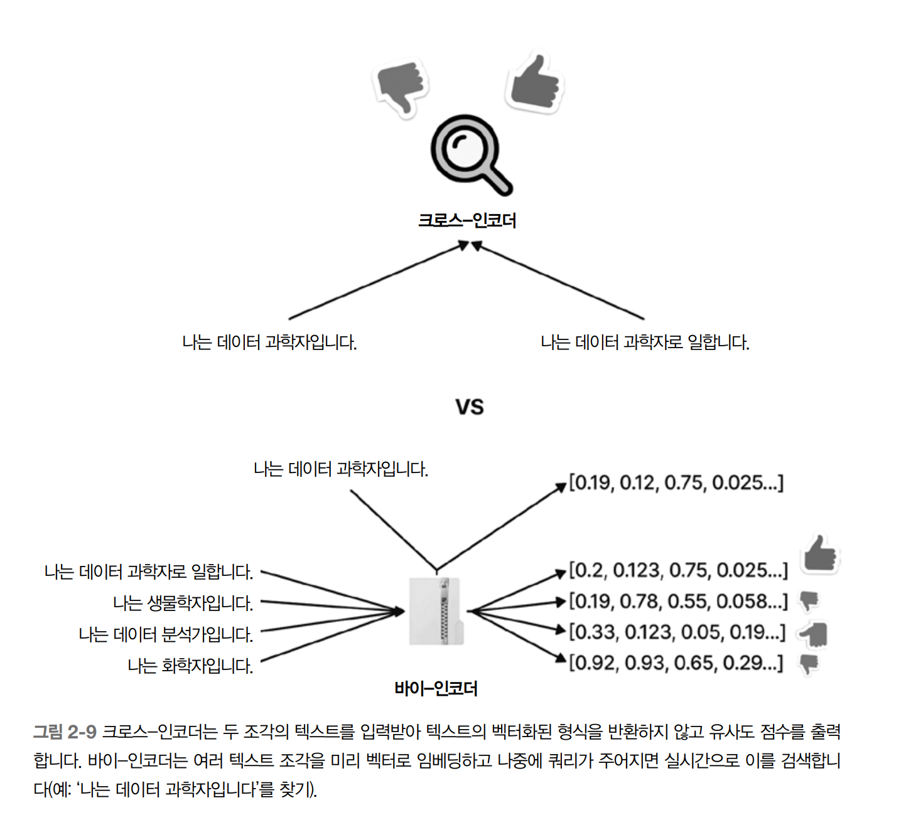
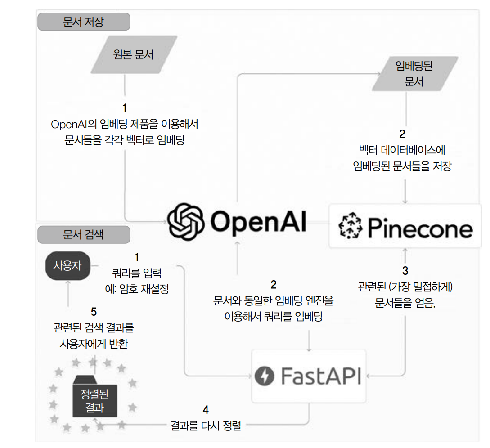

#  LLM을 이용한 의미 기반 검색(Semantic Search)

## 2.1 들어가는 글

- 검색 알고리즘 예
  - 구매 품목을 검색 시 TCG 매직 카드를 단순히 빈티지 매직 카드라고 검색할 수 있습니다. 그러면 시스템은 이 검색어(쿼리)를 임베딩하고 가까운 텍스트 임베딩이 유사하다고 판단합니다.
   - 즉, 유사한 문구를 나타내는 벡터는 가까워야 하고 서로 다른 문구를 나타내는 벡터는 멀리 떨어져 있어야 합니다.
   - 벡터는 일종의 해시로 생각할 수 있으며, 벡터는 다시 텍스트로 되돌릴 수 없지만 인코딩된 상태에서 점수를 비교할 수 있는 추가적인 이점을 가진 텍스트의 표현입니다.
   - LLM을 활용한 텍스트 임베딩을 통해 단어와 문구의 표면적인 구문이나 철자를 넘어서는 의미를 포착할 수 있습니다.

## 2.2 작업

- 의미 기반 검색이 단순히 텍스트를 비교하여 검색하는 기존 전통적인 검색 엔진보다 검색 결과가 좋을 수 있다.

### 2.2.1 비대칭적 의미 기반 검색
- 의미기반 검색 시스템: 사용자 쿼리의 의미와 맥락을 이해하고 이를 검색 가능한 문서의 의미 및 맥락과 대조하여 정확한 키워드나 n-gram 일치에 의존하지 않고도 데이터베이스에서 관련된 결과를 찾아낼 수 있다.
- 비대칭적 의미 기반 검색의 비대칭(asymmetric): 입력 쿼리의 의미 정보와 검색 시스템이 검색해야 하는 문서/정보 사이에 불균현이 있다는 사실을 의미한다.
  - 예를 들어 "매직 더 개더링 카드"를 온라인 쇼핑몰의 긴 품목 설명 문단과 비교하려는 검색 시스템은 비대칭으로 간주한다.
  - 네 단어의 쿼리는 문단보다 훨씬 적은 정보를 가지고 있지만 실제로 비교해야 하는 것은 이 쿼리이다.
  - 비대칭 의미 기반 검색 시스템은 쿼리에 정확한 단어를 사용하지 않더라도 정확한 검색 결과를 얻을 수 있다. 이 시스템은 사용자가 검색해야 하는 단어를 정확히 알고 있다고 생각하지 않고 LLM의 학습에 의존한다.
- 단점
  - 대문자 또는 구두점의 차이와 같은 텍스트의 작은 변화에 지나치게 민감하다.
  - 현지화된 문화 지식에 의존하는 충자나 아이러니 같은 애매한 개념에 어려움을 겪을 수 있다.
  - 기존 방식보다 구현하고 유지하는 데 많은 계산 비용이 든다.


## 2.3 솔루션 개요

- 비대칭적 의미 기반 검색 시스템의 일반적인 흐름

  
  1. 문서 저장
    1. 임베딩을 위한 문서 저장
    2. 의미 정보를 인코딩하기 위한 텍스트 임베딩 생성
    3. 검색용 임베딩 DB 저장

  

  2. 문서 검색
    1. 사용자가 항목을 검색하여 전처리되고 정리할 수 있는 쿼리
    2. 임베딩 유사도를 통해 후보 문서 검색 (예: 유클리드 거리)
    3. 후보 문서의 순위를 재조정 (re-ranking)
    4. 최종 결과 반환

## 2.4 구성 요소
### 2.4.1 텍스트 임베더

- 의미 기반 검색의 핵심 text embedder
  - 텍스트 문서나 단어 또는 구문을 벡터로 변환합니다.
  - 텍스트 임베더의 선택은 텍스트를 벡터로 표현하는 품질을 결정하기 때문에 매우 중요합니다.
  - LLM으로 벡터화하는 방법에 대해 오픈소스와 클로즈드 소스 모두 여러 가지 옵션이 있으며, OpenAI의 클로즈드 소스 임베딩 제품을 책에서는 사용합니다.

* 무엇이 텍스트를 유사하게 만드는가

  

- 임베딩 메커니즘은 앞서 설명한대로 유사한 항목이 코사인 유사도가 크다. 

- 일단 텍스트를 벡터로 변환하면 조각끼리 유사한지 여부를 파악하기 위해 수학적으로 표현해얗하며 코사인 유사도는 두 벡터가 얼마나 유사한지를 측정하는 방법이다
  - 이는 두 벡터 사이의 각도를 살펴보고 방향이 얼마나 가까운지에 따라 점수를 매긴다
  - 벡터가 같은 방향이면 1 90도면 0 반대면 -1로 방향만 중요하다
  - open ai 임베딩은 벡터의 크기는 기본적으로 길이 1로 정규화 되기 때문에 두가지 이점이 있다
    - 코사인 유사도가 내적과 동일
    - 코사인 유사도와 유클리드 거리는 동일한 순위의 결과
  - 간단한 코사인 계산만으로 벡터가 얼마나 가까운 위치인지 알수 있다

* Open AI 의 임베딩 엔진

- 임베딩 메커니즘은 앞서 설명한대로 유사한 항목이 코사인 유사도가 크다. 

```py
## 스크립트를 실행하기 위해 필요한 모듈을 가져오기 
# openai 에서 텍스트 임베딩 얻기
import openai

# Set up OpenAI API credentials
openai.api_key = "YOUR_API_KEY"

# Define the text to be embedded
text = "This is the text to be embedded."

# Specify the engine (model) to be used
model = "text-embedding-ada-002"

# Generate the text embedding
response = openai.Embedding.create(input=text, model=model)

# Extract the embedding from the response
embedding = response['data'][0]['embedding']

# Print the embedding
print(embedding)
```

* 오픈 소스 대안
  - BERT를 이요한 바이-인코더(bi-encoder)로 이는 다양한 자연어 처리 작업에 대해 최첨단 결과를 도출해 낼수있음이 증명된 강력한 딥러닝 기반 알고리즘!
  - 많은 오픈 소스 저장소에서 사전 훈련된 바이-인코더를 찾을 수 있는데 이 중 문장 트랜스포머(sentence transformers)라이브러리는 다양한 자연어 처리 작업을 위해 사전 훈련된 모델을 제공
    - 바이-인코더
      - 두개의 BERT 모델을 훈련시키는 과정
      - 하나는 입력 텍스트를 인코딩하며 다른 하나는 출력 텍스트를 인코딩
      - 이 두 모델은 입력과 출력 텍스트의 쌍이 서로가 최대한 유사하도록 큰 텍스트 데이터 말뭉치에서 동시에 훈련하여 결과적으로 입력과 출력 텍스트 사이의 의미적 관계를 포착한다

```py
# 사전훈련된 오픈 소스 바이-인코더로부터 텍스트 임베딩 가져오기
# Import the necessary libraries
from sentence_transformers import SentenceTransformer
from tqdm import tqdm

# Specify the model to be used
model_name = 'bert-base-nli-mean-tokens'

# Load the pre-trained bi-encoder model
model = SentenceTransformer(model_name)

# Define the texts to be embedded
texts = [
    "This is the first text to be embedded.",
    "This is the second text to be embedded.",
    "This is the third text to be embedded."
    # Add more texts as needed
]

# Generate the text embeddings with progress bar
embeddings = []
for text in tqdm(texts, desc="Generating embeddings"):
    embedding = model.encode([text])
    embeddings.append(embedding)

# Print the embeddings
for i, embedding in enumerate(embeddings):
    print(f"Embedding for text {i+1}: {embedding}")
```

  - 위 코드는 SentenceTransformer 클래스의 인스턴스를 생성하여 사전 훈련 모델인 bert-base-nli-mean-tokens 사용
    - SentenceTransformer 클래스의 encoder를 사용하여 결과로 얻은 임베딩을 doc_emb변수에 저장한다

### 2.4.2 문서 청킹

- 논문과 같은 긴 문서 전체를 단일 벡터로 임베딩하는것은 실용적이지 못하며 해결방법은 문서청킹(document chunking)을 사용하는것 
- 문서 청킹: 큰 문서를 임베딩하기 위해 더 작고 관리 가능한 청크로 나누는 것을 의미

* 최대 토큰 범위 분할(max token window chunking)
  - 문서 청킹 한가지 방법으로 주어진 최대 크기의 청크로 문서를 나누는것을 포함
  - 토큰 범위를 500으로 설정하면 각 청크가 500토큰보다 약간 작을 것으로 예상한다
  - 우려사항 중 하나는 중요한 텍스트 일부를 나눠진 청크 사이에서 잘라낼 수 있어, 문맥이 분리될 수 있다
    - 이를 해결하기 위해 청크 사이에 공유되도록 토큰이 겹치는 범위를 설정할수있다

* 맞춤형 구분 기호 찾기
  - 청킹 방법을 돕기 위해 페이지 분리나 단락 사이에 새로운 줄과 같은 자연 구분기호룰 사용할수있다



* 클러스터링을 사용하여 의미 기반 문서 생성
  - 의미적으로 유사한 작은 청크를 결합하여 새로운 문서를 생성하는 방법



* 청크로 나누지 않고 전체 문서 사용
  - 가장 쉬운방식이지만 고려해야할 항목이 많다

### 2.4.3 벡터 데이터베이스(vector database)
- LLM에 의해 생성된 임베딩을 저장하는데 유용
- 이웃 탐색 을 효율적으로 한다

### 2.4.4 파인콘(pinecone)
- 소규모와 중규모의 데이터셋(일반적으로 100만개 이하)을 위해 설계된 벡터 데이터 베이스

### 2.4.5 오픈소스대안
- Pgvector, PostgreSQL 확장 기능등이 있음

### 2.4.6 검색결과 재순위화
- 코사인 유사도를 사용하여 주어진 쿼리에 대한 잠재적 결과를 검색한 후에는 사용자에게 관련된 결과가 제시되도록 순위를 다시 지정하는것이 유용할때가 많다
- 결과를 재순위화(re-ranking) 하는 한가지 방법으로 크로스 인코더(cross-encoder)를 사용
- 더 정확한 추천을 제공하기 위해 작업 특정 데이터셋에서 사전 훈련된 크로스-인코더 모델을 파인튜닝할 수도 있다



## 2.5 통합



-. 문서저장
  1. 임베딩을 위한 문서 저장 - 청크
  2. 텍스트 임베딩 생성 - openai 임베딩
  3. 임베딩 디비 저장 - 파인콘
  
-. 문서 검색
  1. api - fastApi
  2. 후보문서 검색 - OpenAi의 임베딩 + 파인콘
  3. 문서 재순위화 - 크로스 인코더
  4. 최종 검색 결과 반한 - fastApi

### 2.5.1 성능
- BoolQ 데이터셋으로 성능 테스트가 가능
  - boolq 16000개의 예시를 포함한 예/아니오 질문에 대한 질문-답변 데이터셋

## 2.6 클로즈드 소스 구성 요소의 비용
-  100만 개의 임베딩을 가진 시스템을 구축, 완전히 새로운 임베딩으로 매달 한 번 인덱스를 업데이트시 월별 총비용
  - 파인콘 비용 = $70
  - OpenAI 비용 = $50
  - FastAPI 비용 = $7
  - 총 비용 = $70 + $50 + $7 = $127/월

