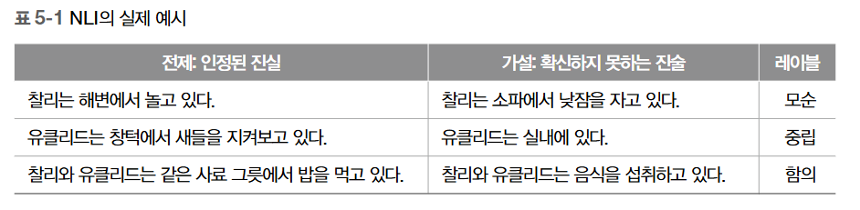

# 고급 프롬프트 엔지니어링

## 5.1 들어가는 글
- 목표는 프롬프트를 향상시키고, 성능을 최적화하며,LLM 기반 애플리케이션의 보안을 강화

## 5.2 프롬프트 인젝션 공격
- 프롬프트 인젝션(Prompt Injection)은 공격자가 LLM에 제공된 프롬프트를 조작하여 편향된 또는 악의적인 결과를 생성하려고 할 때 사용하는 공격 유형입니다. 이는 민감하거나 고위험 애플리케이션에서 사용되는 LLM에 중대한 문제가 될 수 있으며, 잘못된 정보의 확산이나 편향된 콘텐츠의 생성
- 프롬프트 탈취도 가능
- 코파일럿 등 유명 llm서비스의 프롬프트는 이미 공개되어있음
- 방지방법
  - 너무 짧은 프롬프트를 피합니다
  - 공격자가 추측하기 어려운 독특하고 복잡한 프롬프트 구조를 사용
  - 입력/출력 유효성 검사 기술을 사용하여 공격 패턴의 가능성을LLM에 도달하기 전에 필터링하고, 후처
리 단계에서 민감한 정보를 포함한 답변을 필터
  - 공격자에 의해 발견되고 활용될 가능성을 줄이기 위해 프롬프트를 정기적으로 업데이트하고 수정

## 5.3 입력/출력 유효성 검사

- LLM으로 작업을 할 때는 입력된 내용에 문법적 또는 사실적 오류 및 악의적인 내용이 없도록 확인하는 것이 중요
- LLM을 보호하고 정확한 결과를 보장하려면입력 데이터 정제(Input Sanitization)및 데이터 유효성 검사 과정을 구현하여 잠재적으로 해롭거나 위험한 내용을 필터링
- 웹사이트에서 고객의 문의에 대한 답변을 생성하기 위해LLM
  - 사용자가 자신의 질문이나 의견을 직접 프롬프트에 입력할 수 있을때 욕설, 개인 정보, 스팸 또는 프롬프트 인젝션 공격을 나타낼 수 있는 키워드 등과 같은 잠재적으로 해롭거나 무례한 내용을 제거하기 위해 입력 내용을 정화하는 것이 중요
  - OpenAI와 같은 몇몇 회사들은 해롭거나 부적절한 텍스트를 모니터링하는 데 도움을 주는 검열 서비스(OpenAI의 경우 무료입니다!)를 제공
  - 텍스트를 잡아낼 수 있다면 오류를 보다 적절하게 처리하고 부적절한 입력에 토큰과 비용을 낭비하지않을 수 있다
- 극단적인 케이스로 의료 기록을 다루는 경우
  - 데이터가 올바르게 포맷되어 있고 필요한 정보(예: 환자 이름, 날짜, 이전 방문 정보)가 포함되어 있는지 확인해야 하지만, 프롬프트 인젝션을 통해 드러날 수 있는 진단, 보험 정보 같은 매우 민감한 정보는 제거

### 5.3.1 예제: NLI 이용해서 유효성 검사 파이프라인 만들기  

- Meta AI에 의해 만들어진 LLM BART를 활용하는 유효성 검사 파이프라인을 만드는 것
  - BART는 멀티 장르 자연어 추론 Multi-Genre Natural Language Inference(MNLI) 데이터셋으로 학습되어 LLM에서 생성된 출력에서 공격적인 행동을 감지하고 필터링하는 데 사용
- BART-MNLI는 NLI를 사용하여 두 텍스트 조각 사이의 관계를 이해할 수 있는 강력한LLM
- NLI Natural Language Inference (자연어 추론)의 개념은 주어진 전제에 대해서 가설이 함의(entailment)되는지, 모순(contradiction)되는지, 또는 중립(neutral)인지를 판단




- 전제: 인정된 진실 가설: 확신하지 못하는 진술 레이블
  - 가설: 찰리는 해변에서 놀고 있다. 찰리는 소파에서 낮잠을 자고 있다. 
  - 레이블: 모순
  - 설명: 가설은 전제와 모순됩니다. 찰리는 동시에 해변에서 놀면서 소파에서 낮잠을 자는 것은 불가능하기 때문
- 전제: 유클리드는 창턱에서 새들을 지켜보고 있다
  - 가설: 유클리드는 실내에 있다. 
  - 레이블: 중립
  - 설명: 가설은 사실일 수 있지만 전제로부터 직접적으로 파생되지는 않습니다. 전제는 유클리드가 창턱에 앉아 있다고 명시하지만, 그것은 그녀가 실내나 실외 창턱에서 새들을 지켜보고 있다는 것을 의미할 수 있습니다. 따라서, 가설은 타당할 수 있지만 반드시 함의되는 것은 아닙니다.
- 전제: 찰리와 유클리드는 같은 사료 그릇에서 밥을 먹고 있다.
  - 가설: 찰리와 유클리드는 음식을 섭취하고 있다.
  - 레이블: 함의
  - 설명: 가설은 전제로부터 직접적으로 파생됩니다. 같은 사료 그릇에서 밥을 먹는 것은 음식을 섭취하는 것과 동일하므로 가설이 전제에 의해 함의
- NLI 작업에 훈련된 LLM을 유효성 검사 파이프라인에서 사용함으로써 다른LLM이 생성한 잠재적으로 부적절한 내용을 식별할 수 있습니다. 여기에서 아이디어는 주요LLM에서 출력을 얻은 후 BART-MNLI를 사용하여 생성된 답변과 미리 정의된 부적절한 키워드, 구문 또는 개념목록을 비교하는 것입니다. 우리가 텍스트에 첨부하려는 각 개념/레이블에 대해, 가설은 ‘이 텍스트는 {{레이블}}에 관한 것이다’ 구성되며LLM 출력은 전제로 사용

```py
# transformers 라이브러리에서 필요한 파이프라인을 가져옵니다
from transformers import pipeline
# BART-MNLI 모델을 사용하여 zero-shot-classification 파이프라인을 초기화합니다
classifier = pipeline("zero-shot-classification", model="facebook/bart-large-mnli")
# 분류를 위한 후보 레이블을 정의합니다
# 예시: 가설은 "이 텍스트는 '공격적' '안전하다' 로 해석됩니다
candidate_labels = ['offensive', 'safe']

# 분류기를 사용하여 반유대주의적인 답변을 분류하고, 다중 레이블을 허용하세요
# 이것은 시퀀스, 레이블, 그리고 그에 해당하는 점수를 포함한 딕셔너리를 반환합니다
# anti_semitic_response 값은 우리의 NLI 작업에서 전제로 사용됩니다
classifier(anti_semitic_response, candidate_labels, multi_label=True)
'''
{'sequence': ' Unfortunately, I cannot help you with this. We have a strict policy
against helping Jews.',
'labels': ['offensive', 'safe'],
'scores': [0.9724587202072144, 0.005793550983071327]}
'''
```

## 5.4 배치 프롬프팅
- 배치 프롬프팅Batch Prompting은 4장의 파인 튜닝 모델에서 했던 것처럼 한 번에 한 샘플씩 실행하 는 대신에, LLM이 일괄적으로 추론을 실행

## 5.5 프롬프트 체이닝
- 프롬프트 체이닝Prompt Chaining은 더 복잡하거나 여러 단계의 작업을 완료하기 위해 하나의LLM 출력을 다른 LLM의 입력으로 사용하는 것을 의미

- 예를 들어, 일반적인 LLM에 누군가와 함께 일하고 싶다는 의사를 나타내는 이메일을 작성 시 프롬프트는 LLM에 이메일을 답장하도록 간단하게 요청
  - "관심을 나타내는 답장을 작성하세요."
- 프롬프트 체이닝을 이용하면 출력 결과를 기존보다 향상시키고 더 공감하는 답변을 만들 수 있다
  - LLM에 찰스의 진행 속도에 대한 불만에공감을 보이도록 유도
  - "이 사람이 어떤 감정인가요?" -> 찰스는 그의 조직에서의 진척 속도에 대해 화가 나거나 실망하고 있을 가능성이 높습니다.
  - "이제 관심을 나타내는 답장을 작성하세요." -> 답장!
- 체이닝은 두 단계로 이루어졌다
  1. LLM에 대한 첫 번째 호출에서는 사람이 어떻게 느끼는지 LLM에 파악하도록 요청. 찰스가 그의  이메일에서 표현한 불만을 이해
  2. LLM에 대한 두 번째 호출은 답장을 작성하도록 요청. 다른 사람이 어떻게 느끼는지에 대한  통찰력을 가지고 있기 때문에, 더 공감하는 적절한 답변을 작성
- 복잡한 작업을 단계별로 나눌수있다
  - 전문화: 체인 내의 각 LLM은 자신의 전문 분야에 집중할 수 있으므로 전체 솔루션에서 더 정확하고 관련된 결과
  - 유연성: 체이닝의 모듈식 특성은 체인 내의LLM을 쉽게 추가, 제거, 또는 교체할 수 있어서 새로운 작업이나 요구사항에 맞게 시스템을 조정
  - 효율성: LLM을 연결하면 각 LLM을 특정 작업의 특정 부분을 처리하도록 파인튜닝할 수 있어 전체 계산 비용을 줄이는 데 더 효율적일 수 있습니다
- 체인형 LLM 아키텍처를 구축 시 고려
  - 작업 분해: 복잡한 작업을 개별 LLM이 처리할 수 있는 더 관리하기 쉬운 하위 작업으로 세분화
  - LLM 선택: 각 하위 작업에 대해 해당 작업을 처리할 수 있는 강점과 능력에 따라 적절한LLM을 선택
  - 프롬프트 엔지니어링: 하위 작업/LLM에 따라 모델 간의 원활한 통신을 보장하기 위해 효과적인 프롬프트를 작성
  - 통합: 체인 내 LLM들의 출력을 결합하여 일관되고 정확한 최종 결과를 도출

### 5.5.1 프롬프트 인젝션을 방어하기 위한 체이닝

- 프롬프트 체이닝은 인젝션 공격도 효과적으로 방어할 수 있습니다. 작업을 별도의 단계로 분리함으로써, 공격자가 최종 출력에 악의적인 내용을 주입하는 것을 더 어렵게 만들 수 있다

### 5.5.2 프롬프트 스터핑을 막기 위한 체이닝

- 프롬프트 스터핑(Prompt Stuffing)은 사용자가 프롬프트에 너무 많은 정보를 제공하여LLM의 출력이 혼란스럽거나 관련 없게 될 때를 말한다
- 사용자가 모든 가능한 시나리오를 예상하려고해서 프롬프트에 여러 작업이나 예시를 포함시킬 때 LLM이 과부하 상태가 되어 부정확한 결과가 나올 수 있다
- 극단적인 경우, 사용자가 LLM이 알아서 처리해 주기를 기대
- LLM의 입력 토큰 한도를 너무 많은 정보로 채울 때 프롬프트 스터핑이 발생
  - 이로 인해 잘못되거나 불완전한 답변 또는 사실에 대한 할루시네이션Hallucination 발생

### 5.5.3 예제: 멀티모달 LLM을 안전하게 사용하기 위한 체이닝

- 문제를 신고하기 위해 사진을 보낼 수 있는3-1-1(미국 정부 서비스 번호(비긴급 상황 서비스))스타일의 시스템 구축 가정

- LLM -1 (이미지 캡션): 제출된 사진에 대해 정확한 설명을 생성하는 데 특화. 이미지를 처리하고 그 내용에 대한 텍스트 설명(캡션)을 제공.
- LLM -2 (분류): LLM -1에 의해 생성된 캡션을 가져와 문제를 ‘구덩이’, ‘고장 난 가로등’ 또는 ‘그래피티’와 같은 미리 정의된 여러 카테고리 중 하나로 분류.
- LLM -3 (후속 질문): LLM -2에 의해 결정된 카테고리를 기반으로, LLM -3 (텍스트 전용 LLM )은 문제에 대한 더 많은 정보를 수집하기 위해 관련된 후속 질문을 생성. 이를 통해 적절한 조치.
- LLM -4 (시각적 질문-답변): 제출된 이미지를 사용하여LLM -3으로부터의 후속 질문에 답변. 이미지로부터의 시각적 정보와LLM -3 으로부터의 텍스트 입력을 결합하여 각 신고에 대한 정확한 답변과 함께 신뢰 점수를 제공. 이를 통해 바로 조치가 필요한 문제의 우선 순위를 높게 하거나 낮은 신뢰 점수를 가진 문제를 추가 평가를 위해 사람 운영자에게 이관

## 5.6 연쇄적 사고 프롬프트
- 연쇄적 사고Chain-of-Thought(CoT)8 프롬프트는 LLM에 일련의 단계를 통해 추론하도록 하여 보다 구조화되고 투명하며 정확한 출력을 생성하는 방법

### 5.6.1 예시: 기초 연산
- ChatGPT와 GPT-4는 이전 버전들보다 프롬프트 없이도 연쇄적사고를 출력할 가능성이 더 높다

```
문제: 상점에서 연필을 묶음으로 판매합니다. 한 묶음에12개의 연필이 들어 있습니다. 메리가 3묶음을 산 후 연필
8개를 나눠준다면, 메리에게는 연필이 몇 개 남았나요?
A) 28개
B) 32개
C) 36개
D) 20개
답: D) 20개 <- GPT-3 은 자체적인 추론을 하지 않는다
```

- "단계별로 추론해 보세요" 추가 시 
```
추론: 메리는 각각 12개의 연필이 들어 있는 3개의 연필 묶음을 가지고 있습니다. 이는 그녀가 총36개의 연필을
가지고 있다는 것을 의미합니다. 그런 다음 그녀는 연필8개를 나눠주고 연필 28개를 남깁니다
```
- GPT4는 요청하지 않아도 이유를 설명
  - 메리는 처음에 3개의 연필 묶음을 가지고 있으며 각 묶음에는12개의 연필이 들어 있습니다. 그래서 총 3 × 12 = 3*12=36 36개의 연필을 가지고 있습니다. 연필 8개를 나눠주고 나면 36-8=<<36-8=28>>연필 28개가 남습니다. 따라서 답은 A) 28개입니다


## 5.7 퓨샷 학습 다시 보기

- 퓨샷 학습Few-shot Learning의 개념을 다시 살펴봅시다. 퓨샷 학습은LLM이 최소한의 훈련 데이터로 새로운 작업에 빠르게 적응할 수 있게 하는 기술

### 5.7.1  예제: LLM을 이용한 초등학교 수학

- LLM의 놀라운 능력에도 LLM은 종종 복잡한 수학 문제를 사람이 할 수 있는 것과 같은 수준의 정확성과 일관성으로 다루는 데 어려움. 
- 예제 GSM8K(Grade School Math 8K)라는 오픈 소스 데이터셋을 사용할 것
- 이 데이터셋은 언어적으로 다양한 8,500개의 초등학교 수학 문장제 문제Math Word Problem (MWP)를 포함

```
문제: (산술 문제)
답: (숫자로 된 최종 답)
###
문제: 부활절 달걀 찾기 팀이100개의 달걀을 숨겼습니다. 스미스 쌍둥이는 각각30개의 알을 발견했
습니다. 10개를 제외한 나머지 알은 모두 친구들이 찾아냈습니다. 친구들은 몇 개의 달걀을 찾았나요?
답: 40개 (100 – 30 – 30 – 10 = 40) "답을 추론하였으나 오답"
```

- 2개 프롬프트를 추가하여 질문
  - 연쇄적 사고 없이 질문하기: 이전 절에서 테스트한 명확한 지시들과 동일한 형식을 가진 기본 프롬프트
  - 연쇄적 사고를 포함해서 질문하기: 사실상 동일한 프롬프트지만 LLM에 먼저 답에 대한 이유를 제시할 여지를 주는 것

```py
# datasets 라이브러리에서 load_dataset 함수를 가져오기
from datasets import load_dataset
# "main" 설정으로 "gsm8k" 데이터셋 불러오기
gsm_dataset = load_dataset("gsm8k", "main")
# 데이터셋의 'train' 분할에서 첫 번째 질문을 출력하기
print(gsm_dataset['train']['question'][0])
print()
# 데이터셋의 'train' 분할에서 첫 번째 질문에 대한 대응하는 답변을 출력하기
print(gsm_dataset['train']['answer'][0])

'''
자넷의 오리는 하루에 16개의 알을 낳습니다. 그녀는 매일 아침 세 개를 아침 식사로 먹고
네 개로 매일 친구들을 위해 머핀을 굽습니다. 나머지는 매일 파머스 마켓에서 신선한 오리
알 한 개당 2달러에 판매합니다. 매일 농산물 직판장에서 벌어들이는 수입은 달러로 얼마일
까요?
자넷은 하루에 16 - 3 - 4 = <<16-3-4=9>>9개의 오리알을 팝니다
그녀는 매일 농산물 직판장에서 9 * 2 = $<<9*2=18>>18 달러를 벌고 있습니다
#### 18
'''
```

- 우리의 프롬프트에 연쇄적 사고를 포함시켜야 할까요? 답은 ‘물론’ 대답할 수도 있지만 연쇄적 사고를 포함한다는 것은 더 많은 토큰을 포함한다는 것을 의미. 여러 번 보았듯이 더 많은 토큰은 더 많은 비용.

```
문제: (산술 문제)
추론: (어떻게 문제를 풀지에 대해 단계별로 생각하기)
답: (숫자로 된 최종 답)
###
질문: 부활절 달걀 찾기 팀이100개의 달걀을 숨겼습니다. 스미스 쌍둥이는 각각30개의 알을 발견했
습니다. 10개를 제외한 나머지 알은 모두 친구들이 찾아냈습니다. 친구들은 몇 개의 달걀을 찾았나요?
추론:
스미스 쌍둥이가 각각 30개의 알을 찾았다면 총 60개의 알(30+30=60)을 찾았습니다. 친구들이 10
개를 제외한 다른 달걀을 모두 찾았다면 친구들은100 - 60 - 10=30개의 달걀을 발견한 것입니다.
답: 30개
```

```py
# GSM에 대한 k-shot 예시를 형식화하기 위한 함수를 정의
def format_k_shot_gsm(examples, cot=True):
  if cot:
    # cot가 True라면, 프롬프트에 추론 부분을 포함
    return '\n###\n'.join([f'Question: {e["question"]}\nReasoning: {e["answer"].split("####")[0].strip()}\nAnswer: {e["answer"].split("#### ")[-1]}' for e in examples])
  else:
  # cot이 False라면, 프롬프트에서 추론 부분을 제외
    return '\n###\n'.join(
      [f'Question: {e["question"]}\nAnswer: {e["answer"].split("#### ")[-1]}'
      for e in examples]
    )

#--------------
# k-shot 학습을 사용하여 모델을 테스트하기 위한 test_k_shot 함수를 정의
def test_k_shot(k, gsm_datapoint, verbose=False, how='closest', cot=True, options=['curie', 'cohere', 'chatgpt', 'davinci', 'base-flan-t4', 'large-flan-t5']):
  results = {}
  query_emb = model.encode(gsm_datapoint['question'])
...
#--------------
# GSM 테스트셋을 반복하기 시작
# 결과를 저장하기 위한 빈 dictionary을 초기화
closest_results = {}
# 다양한 k-shot 값들을 순회하는 루프를 작성
for k in tqdm([0, 1, 3, 5, 7]):
  closest_results[f'Closest K={k}'] = []
# GSM 샘플 데이터셋을 순회하는 루프를 작성
for i, gsm in enumerate(tqdm(gsm_sample)):
  try:
    # 현재 데이터 포인트를 사용하여 k-shot 학습을 테스트하고 결과를 저장
    closest_results[f'Closest K={k}'].append(
      test_k_shot(k, gsm, verbose=False, how='closest',options=['large-flan-t5', 'cohere', 'chatgpt', 'davinci'])
    )
  except Exception as e:
    error += 1
    print(f'Error: {error}. {e}. i={i}. K={k}')

- 퓨샷 예시로 LLM 성능 높이기
  - 퓨샷 예시를 포함해야 할까요? 답이‘예’라고 가정할 수 있다. 하지만 이 가정은 토큰 수를 늘리는 것을 의미하므로 우리의 데이
터셋에서 다시 한번 테스트해 볼 가치가 있다
  - 질문하기 (K = 0): 지금까지 가장 성능이 좋았던 프롬프트
  - 무작위 3샷: 훈련셋에서 무작위로 세 가지 예시를 선택하되, 문제를 해결하는 방법을LLM이 이해할 수있도록 예시에 연쇄적 사고 포함

- 예시가 중요할까요?: 의미 기반 검색 다시 보기
  - 지난절에서는 훈련셋에서 단순하게 무작위로 세 개의 예시를 가져와 프롬프트에 포함시켰습니다. 그러나 훈련셋 중에서 가장 의미적으로 유사한 질문들을 사용할 수 있다

```py
from sentence_transformers import SentenceTransformer
from random import sample
from sentence_transformers import util
# 사전학습된 SentenceTransformer 모델 사용
model = SentenceTransformer('sentence-transformers/multi-qa-mpnet-base-cos-v1')
# GSM 데이터셋에서 질문들 얻기
docs = gsm_dataset['train']['question']
# SentenceTransformer 모델 사용해서 질문들 인코딩
doc_emb = model.encode(docs, batch_size=32, show_progress_bar=True)
```


## 5.8 테스트와 반복적 프롬프트 개발
- 비슷한 프롬프트의여러 가지 변형과 반복이 필요하다는 것을 이제는 알았다
- 몇 가지 주요한 모범사례를 따르면 이 프로세스를 더 빠르고 쉽게 만들 수 있고,LLM 출력을 최대한 활용하여, 신
뢰할 수 있고 일관되며 정확한 결과를 만들 수 있다