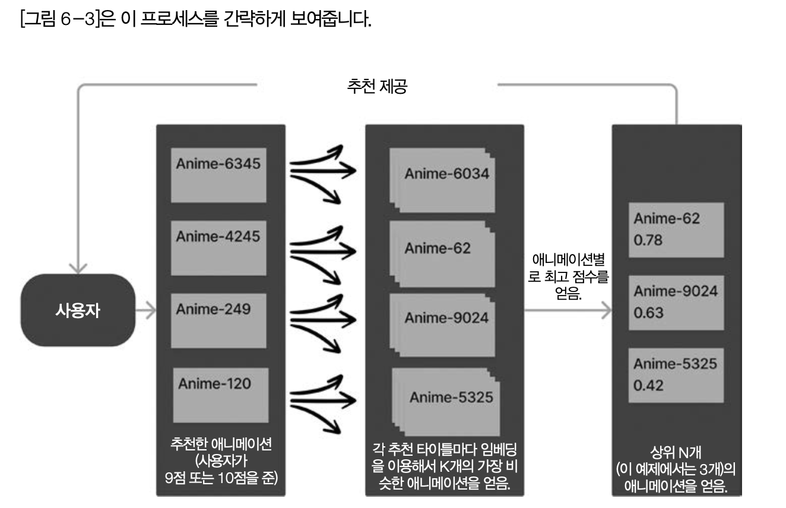

# 임베딩과 모델 아키텍처 맞춤화

## 6.1 들어가는 글
-  임베딩 모델을 파인튜닝하고 사전 훈련된 LLM 모델 아키텍처를 맞춤화

## 6.2 사례 연구: 추천 시스템 만들기
- 6장은 실제 데이터셋을 사례 연구로 사용

### 6.2.1 문제와 데이터 설정하기

- 캐글 MyAnimeList 2020 데이터셋: 애니메이션 제목, 평점 및 사용자 선호도 정보 포함
- 훈련 및 테스트셋으로 분리

```py
# 애니메이션 타이틀을 장르, 줄거리, 제작자 정보 등과 함께 가져오기 # 총 16,206개의 타이틀
pre_merged_anime = pd.read_csv('../data/anime/pre_merged_anime.csv')
# 애니메이션을 **다 본** 사용자가 부여한 평점을 불러오기
# 총 57,633,278개의 평점!
rating_complete = pd.read_csv('../data/anime/rating_complete.csv')
import numpy as np
# 평점 데이터를 90/10 비율로 훈련용/테스트용으로 분할 rating_complete_train, rating_complete_test = \
np.split(rating_complete.sample(frac=1, random_state=42), [int(.9*len(rating_complete))])
```

### 6.2.2 추천의 문제 정의하기
- 패턴 활용(Pattern Exploitation): 사용자 과거 선호도를 바탕으로 사용자가 좋아할 아이템을 추천. 단순히 이전에 상호작용한 아이템과 유사한 아이템을 추 천하는 것. 
- 탐색(Exploration): 사용자가 이전에 고려하지 않았을 아이템 제안

- **콘텐츠 기반 추천 vs 협업 필터링**
  - 추천엔진은 크게 두가지 주요접근방식인콘텐츠기반 협업필터링으로 구분
    - 콘텐츠 기반 추천(Content-based Recommendations)아이템의 특성에 초점을 맞추며, 사용자의 과거 상호작용을 기반으로 비슷한 콘텐츠를 추천
    - 협업 필터링(Collaborative Filtering) 선호도와 행동을 활용하여 유사한 관심사나 취향을 가진 사 용자 간의 패턴을 식별하여 추천
    - 두 가지 방식 모두 기본 원리는 개인화된 추천을 만들기 위해 집단 지성을 활용
    - 콘텐츠 기반 추천과 협업 필터링 추천 모두 결합한 접근 방식을 사용. 
    - 자카드 점수(Jaccard Score)를 고려하여 협업 필터링을 통합. 하이브리드 접근 방식을 통해 두 기술의 강점을 활용하여 더 효과적인 추천 시스템을 만들 수 있다

### 6.2.3 추천 시스템의 전체 개요    

1. 입력: 사용자 ID와 정수 k
2. 높은 평점의 애니메이션 식별: 사용자가 9점 또는 10점(NPS(Net Promoter Score)척도에서 추천 평점)으로 평가한 타이틀에 임베딩 공간에서 가장 가깝게 일치된 항목들을 찾아 관련성 높은 다른 애니메이션 k개 탐색. 애니메이션이 얼마나 자주 추천되는지와 임베딩 공간에서 코사인 점수가 얼마나 높은지를 모두 고려하여 사용자에게 상위 k개의 결과 제공

```py
given: user, k=3
promoted_animes = [] #사용자가 9점 또는 10점을 주었던 모든 애니메이션 타이틀

relevant_animes = []
for each promoted_anime in promoted_animes:
promoted_anime와 코사인 점수에서 코사인 유사도가 가장 높은 k개의 애니메이션을 relevant_animes에 추가
# relevant_animes는 이제 k * promoted_animes만큼의 항목을 가져야 합니다 # (많은 애니메이션은 promoted_animes에 있겠지만)
# 목록에 몇 번 나타나는지와 추천된 애니메이션과의 유사성을 고려한 # 각각의 서로 다른 관련 애니메이션의 가중치 점수를 계산합니다
final_relevant_animes = # 가중 코사인 값/빈도 점수가 가장 높은 상위 k개의 애니메이션
```

