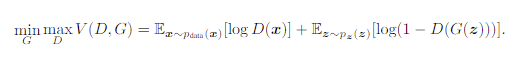
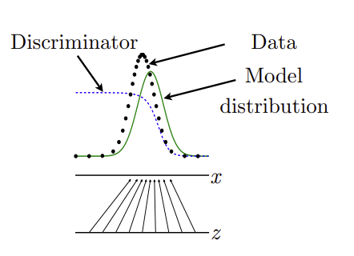

# GAN

> Generative Adversarial Networks
- Adversarial Network는 적대적인 신경망이 서로 경쟁하면서 가짜 모델의 성능을 개선한다

## 확률분포

- 주사위를 던지는 경우
각 값의 확률은 

## 개념

>지폐위조범(Generator)은 경찰을 최대한 열심히 속이려고 하고 다른 한편에서는 경찰(Discriminator)이 이렇게 위조된 지폐를 진짜와 감별하려고(Classify) 노력한다.
이런 경쟁 속에서 두 그룹 모두 속이고 구별하는 서로의 능력이 발전하게 되고 결과적으로는 진짜 지폐와 위조 지폐를 구별할 수 없을 정도(구별할 확률 pd=0.5)에 이른다는 것.

- Discriminator는 진짜 이미지를 진짜(1)로, 가짜를 가짜(0)로 구분하도록 학습한다. 
- 반대로, Generater(Neural Network)는 랜덤한 코드를 통해서 이미지를 생성하며, Discriminator를 속여 가짜 이미지를 진짜처럼 만드는 게 목표이다. 즉, 실제 데이터의 분포와 모델이 생성한 데이터의 분포 간의 차이를 줄이는 것이다.

 - Generative model G는 우리가 갖고 있는 data x의 distribution을 알아내려고 노력합니다. 만약 G가 정확히 data distribution을 모사할 수 있다면 거기서 뽑은 sample은 완벽히 data와 구별할 수 없겠죠.
- 한편 discriminator model D는 현재 자기가 보고 있는 sample이 training data에서 온 것(진짜)인 지 혹은 G로부터 만들어진 것인 지를 구별하여 각각의 경우에 대한 확률을 estimate합니다.

- Generator Network : 랜덤 노이즈 벡터를 입력받아 이미지를 만드는 업샘플링을 진행 
- Discriminator Network : 네트워크에 전달된 이미지가 실제인지 가짜인지를 판별

1) generative model(생성 모델), G : training data의 분포를 모사함 -> discriminative model이 구별하지 못하도록

2) discriminative model(판별모델), D : sample 데이터가 G로부터 나온 데이터가 아닌 실제 training data로부터 나온 데이터일 확률을 추정

- G를 학습하는 과정은 D가 sample 데이터가 G로부터 나온 가짜 데이터와 실제 training 데이터를 판별하는데 실수를 할 확률을 최대화하는 것.
- 이 논문(GAN)에서는 이와 같은 프레임워크를 minimax two-player game으로 표현하고 있다. ->이는 논문에서 나오는 방정식으로 확인가능
- 임의의 함수 G, D의 공간에서, G가 training 데이터 분포를 모사하게 되면서, D가 실제 training 데이터인지 G가 생성해낸 가짜 데이터인지 판별하는 확률은 1/2가 된다. (즉, 실제 데이터와 G가 생성해내는 데이터의 판별이 어려워짐)
- G와 D가 multi-layer perceptrons으로 정의된 경우, 전체 시스템은 back-propagation을 통해 학습된다

## Adversarial nets

- adversarial modeling 프레임워크는 앞서 말했듯이 가장 간단하므로, multi-layer perceptrons 모델 적용
- 학습 초반에는 G가 생성해내는 이미지는 D가 G가 생성해낸 가짜 샘플인지 실제 데이터의 샘플인지 바로 구별할 수 있을 만큼 형편없어, D(G(z))의 결과가 0에 가까움. 
- 즉, z로 부터 G가 생성해낸 이미지가 D가 판별하였을 때 바로 가짜라고 판별할 수 있다고 하는 것을 수식으로 표현한 것이다. 
- 그리고 학습이 진행될수록, G는 실제 데이터의 분포를 모사하면서 D(G(z))의 값이 1이 되도록 발전한다. 이는 G가 생성해낸 이미지가 D가 판별하였을 때 진짜라고 판별해버리는 것을 표현한 것이다.

- 극단적인 예시로 먼저 가장 이상적인 상황에서의 D 케이스
- D는 아주 잘 구별을 하는 녀석이므로 D가 보는 sample x가 실제로 data distribution으로부터 온 녀석이라면 D(x)=1
- 첫번째 term에서 log 값이 사라지고 G(z)가 만들어낸 녀석이라면 D(G(z))=0이므로 두 번째 term 역시 0으로 사라진다
- 이 때가 D의 입장에서 V의 "최대값"을 얻을 수 있다

- Q_model(x|z) : 정의하고자 하는 z값을 줬을 때 x 이미지를 내보내는 모델
- P_data(x) : x라는 data distribution은 있지만 어떻게 생긴지는 모르므로, P 모델을 Q 모델에 가깝게 가도록 함
- 파란 점선 ---  : discriminator distribution (분류 분포) > 학습을 반복하다보면 가장 구분하기 어려운 구별 확률인 1/2 상태가 됨
- 녹색 선 ⎻ : generative distribution (가짜 데이터 분포)
- 검은색 점선 --- : data generating distribution (실제 데이터 분포)

## Theoretical Results

- 위에 정의한 minimax probblem (최소최대문제)가 실제로 풀 수 있는 문제인지 확인이 필요하다. - 이를 위해, (1) 실제 정답이 있는지 (existence)와 (2) 해가 존재한다면 유일한지 (uniqueness) 검증이 필요하다.

### Two Step Approach
> 아래 두 가지를 증명해야 우리가 원하는 바를 해결할 수 있다고 볼 수 있다.

1. Global Optimality of P_g = P_data
- GAN의 Minimax problem이 global optimality를 가지고 있다.
- P_data (data distribution)이 gernerative한 model distribution이 정확히 일치할 때 global optimality이며, 그때 global optimality(P_g = P_data)를 갖는가?

2. Convergence of Algorithm 1
- 우리가 제안하는 알고리즘(discrimiator <-> distribution model 학습하는 과정의 모델)이 실제로 global optimality (P_g = P_data)을 찾을 수 있는가?

- 실제 데이터 분포와 모델 분포 간의 거리가 최소이기 때문에 GAN은 성립한다. 

## Adventages and Disadventages

### Adventages
- 기존의 어떤 방법보다도 사실적인 결과물을 만들 수 있음
- 데이터의 분포를 학습하기 때문에, 확률 모델을 명확하게 정의하지 않아도 Generator가 샘플(fake)을 생성할 수 있음
 - MCMC(Markov Chain Monte Carlo)를 사용하지 않고, backprop을 이용하여 gradient를 구할 수 있음 (한번에 샘플을 생성 가능)
- 네트워크가 매우 샤프하고 degenerator(변형된) 분포를 표현할 수 있음
- Markov Chain 기반 모델에서는 체인 간에 혼합될 수 있도록 분포가 다소 선명하지 않음
Adversarial model은 genertaor의 파라미터가 샘플 데이터에 의해 직접 업데이트 하지 않고, discriminator의 gradient를 이용하여 통계적 이점을 얻음

#### MCMC(Markov Chain Monte Carlo)는 어떤 목표 확률분포(Target Probability Distribution)로부터 랜덤 샘플을 얻는 방법이다.

> MCMC를 이해하기 위해서는 마코프 연쇄 (Markov Chain)과 Monte Carlo 두가지 개념을 이해해야 한다.

- 마코프 연쇄는 시간에 따른 계의 상태의 변화를 나타내며, 매 시간마다 계는 상태를 바꾸거나 같은 상태를 유지하며 상태의 변화를 '전이'라 합니다. 마르코프 성질은 과거와 현재 상태가 주어졌을 때의 미래 상태의 조건부 확률 분포가 과거 상태와는 독립적으로 현재 상태에 의해서만 결정된다는 것을 뜻합니다.
- 몬테 카를로 방법은 난수를 이용하여 함수의 값을 확률적으로 계산하는 알고리즘을 부르는 용어이다. 수학이나 물리학 등에 자주 사용됩니다. 이 방법은 계산하려는 값이 닫힌 형식(closed form)으로 표현되지 않거나 매우 복잡한 경우에 확율/근사적으로 계산할 때 사용되며 유명한 도박의 도시 몬테카를로의 이름을 본따 만들어 졌습니다.

### Difficulties & Disadvantage

1. Simple Example : unstable
- Minimax 최적화 문제를 해결하는 과정이기 때문에, oscillation이 발생하여 모델이 불안정할 수 있다.
- → 두 모델의 성능 차이가 있으면 한쪽으로 치우치기 때문에, DCGAN(Deep Convolution GAN)으로 문제 개선
2. Minibatch Discrimination 
컨버전스가 안되는 경우는 여러 케이스를 보여준다. (use other examples as side information)
3. Ask Somebody
평가를 어떻게 해야할까? 정말 사람 같은 이미지라고 평가할 수 있지만 주관적이다. 또한, 언제 멈춰야 되는지에 대한 기준이 부족하다.
→ Inception score 사용하여 문제 해결 
: classification 하는 모델에 학습이 끝난 모델에서 나온 샘플을 넣어서 클래스가 잘 나오는지(=하나의 클래스로 분류하는지)에 따라서 점수를 측정한다.
4. Mode Collapes (sample diversity)
: minmaxGD = maxminDG ->
- Generaotr 입장에서는 Discriminator가 가장 멍청하게 판단한 최솟값 하나만 보내주면 됨
- 예를 들어, 1~10을 학습할 때 1의 성능이 좋지 않다면 1만 주구장창 보내다가, 나중에는 1은 무조건 real이 아닌 것으로 판단함
= Unrolled Generative Adversarial Model (2016)
5. 학습 데이터의 분포를 따라가기 때문에 어떤 데이터가 생성될지 예측하기 어려움
→ cGAN(Conditional GAN)을 이용하여 문제 개선
66. Helvetica scenario를 피하기 위해 G는 D가 업데이트 하기 전에 학습을 너무 많이 하며 안 됨
Helvetica scenario : generator가 서로 다른 z들을 하나의 output point로 매핑할 때 발생하는 문제

[참조1]http://jaejunyoo.blogspot.com/2017/01/generative-adversarial-nets-2.html

[참조2]https://www.slideshare.net/NaverEngineering/1-gangenerative-adversarial-network

[참조3]https://tobigs.gitbook.io/tobigs/deep-learning/computer-vision/gan-generative-adversarial-network
