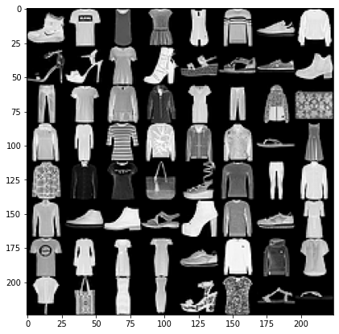
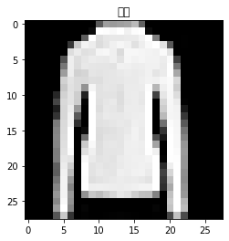
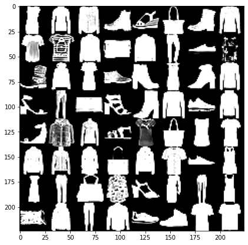

# 패션아이템을 구분하는 DNN

## MNIST 데이터셋 

- torch.utils.data
  - 데이터셋 불러오고 자르고 섞는데 쓰는 도구들 모듈
  - torch.utils.data.dataset 에 데이터셋 표준 정의
  - dataloader 인스턴스의 입력으로 사용 가능
- torchvision.datasets
  - dataset을 상속하는 이미지 데이터셋의 모음(패션 데이터셋)
- torchvision.transforms
  - 이미지 데이터 셋 변환 필터 모듈
  - 크기조절 크롭으로 이미지 수정, 발기 대비 등을 조절도 가능
- torchvision.utils
  - 이미지 데이터를 저장하고 시각화 하기 위한 모듈
  
```py
from torchvision import datasets, transforms, utils
from torch.utils import data
import matplotlib.pyplot as plt
import numpy as np
```

### 이미지를 텐서로 
- transforms: 입력을 변환시키는 도구

```py
transform = transforms.Compose([
    transforms.ToTensor()
])
```

#### transforms 에서 자주 쓰이는 기능
- ToTensor: 이미지 파이토치 텐서로 변환
- Resize: 이미지 크기 조정
- Normalize: 주어진 평균과 표준편차를 이용한 정규화
- RandomHorizontalFlip: 무작위로 이미지 오른쪽과 왼쪽을 뒤집는 기능
- RandomCrop: 이미지를 무작위로 자르는 기능


```py
trainset = datasets.FashionMNIST(
    root = './.data/',
    train = True,
    download = True,
    transform = transform
)
testset = datasets.FashionMNIST(
    root = './.data/',
    train = False,
    download = True,
    transform = transform
)
```

### FasionMNIST

- 패션 MNIST 다운로드, 트레이닝셋과 성능평가용 테스트셋으로 나뉘어져 있다

```py
batch_size = 64

train_loader = data.DataLoader(
    dataset = trainset,
    batch_size = batch_size
)
test_loader = data.DataLoader(
    dataset = testset,
    batch_size = batch_size
)
```

### dataLoader

- batch_size: 한번에 처리하는 데이터 개수(16이면 반복하여 이미지 16개씩 읽음)
- torchvision.datasets로 생성된 객체는 파이토치 내부 클래스 torch.utils.data.Dataset을 상속
- 따라서 DataLoader 즉 데이터셋을 로딩하는 클래스에 바로 사용가능

```py
dataiter = iter(train_loader)
images, labels = next(dataiter)

img = utils.make_grid(images, padding=0)
npimg = img.numpy()
plt.figure(figsize=(10,7))
plt.imshow(np.transpose(npimg, (1,2,0)))
plt.show()
```



### images grid

- utils.make_grid: 여러 이미지를 하나의 이미지 Grid로 만든다
- img.numpy : img는 파이토치 텐서이기에 numpy 함수로 맷플롯립과 호환가능한 넘파이로 변환
- np.transpose: matplotlib과 인식하는 차원순서가 달라 0번 차원을 맨뒤로 보낸다

```py
print(labels)

CLASSES = {
    0: '티셔츠/윗옷',
    1: '바지',
    2: '스웨터',
    3: '드레스',
    4: '코트',
    5: '샌들',
    6: '셔츠',
    7: '운동화',
    8: '가방',
    9: '앵클부츠'
}
for label in labels:
    index = label.item()
    print(CLASSES[index])
```

- print(labels)

tensor([9, 0, 0, 3, 0, 2, 7, 2, 5, 5, 0, 9, 5, 5, 7, 9, 1, 0, 6, 4, 3, 1, 4, 8,
        4, 3, 0, 2, 4, 4, 5, 3, 6, 6, 0, 8, 5, 2, 1, 6, 6, 7, 9, 5, 9, 2, 7, 3,
        0, 3, 3, 3, 7, 2, 2, 6, 6, 8, 3, 3, 5, 0, 5, 5])
- print(CLASSES[index])

앵클부츠
티셔츠/윗옷
티셔츠/윗옷
드레스
티셔츠/윗옷...

###  Fashion MNIST

- 각 픽셀은 0 ~255 값
- 크기는 28 * 28 색상채널은 흑백 1가지 즉 (28*28*1 = 784) x의 특징값 총개수는 784개

```py
idx = 1
item_img = images[idx]
item_npimg = item_img.squeeze().numpy()
plt.title(CLASSES[labels[idx].item()])
plt.imshow(item_npimg, cmap='gray')
plt.show()
```




## 인공 신경망으로 패션 아이템 분류하기(DNN Deep neural network)

```py
import torch
import torch.nn as nn
import torch.optim as optim
import torch.nn.functional as F
from torchvision import transforms, datasets

USE_CUDA = torch.cuda.is_available()
DEVICE = torch.device("CUDA" if USE_CUDA else "cpu")
print(DEVICE)

EPOCHS = 30
BATCH_SIZE = 64
```

### 이미지 분류 문제

> 한 장의 이미지가 어느 클래스에 속하는지 알려주는 문제. 비디오 분류 모델들도 결국 이미지 분류

- 신경망 모델 
  - 입력 x와 레이블 y를 받아 학습 이후 새로운 x가 어떤 패션 아이템인지 예측
  - 레이어가3개인 3층 인공 신경망으로 구축

```py
class Net(nn.Module):
    def __init__(self):
        super(Net, self).__init__()
        self.fc1 = nn.Linear(784, 256)
        self.fc2 = nn.Linear(256, 128)
        self.fc3 = nn.Linear(128, 10)
        
    def forward(self, x):
        x = x.view(-1, 784)
        x = F.relu(self.fc1(x))
        x = F.relu(self.fc2(x))
        x = self.fc3(x)
        return x
```

### 신경망 구현

- 가중치 변수들이 들어가는 연산 선언
- nn.Linear 클래스는 선형결합 수행하는 객체를 만든다
    - 인자: 입력의 차원, 출력의 차원
- fc1은 픽셀값 784개 입력받아 가중치를 행렬곱하고 편향을 더해 값 256개 출력
- fc2와 fc3을 거쳐 마지막에 값 10개를 출력하여 값이 가장큰 클래스가 예측값
- view 함수로 1차원 행렬로 만든후 fc1, fc2 함수를 거친 데이터는 ReLU 활성화 함수를 거친다
- torch.nn.ReLU 함수도 이용가능하나 가중치가 없는 연산은 torch.nn.functional에 있는 함수를 직접 사용하기도한다

```py
model = Net().to(DEVICE)
optimizer = optim.SGD(model.parameters(), lr = 0.01)
print(model.parameters())
```

- 모델의 설계는 끝났고 최적화알고리즘으로 SGD를 사용
  - model 내부 정보를 넘기는 model.parateters와 학습률 0.01 사용

```py
def train(model, train_loader, optimizer):
    model.train()
    for batch_idx, (data, target) in  enumerate(train_loader):
        # 학습 데이터를 DEVICE의 메모리로 보냄
        data, target = data.to(DEVICE), target.to(DEVICE)
        optimizer.zero_grad()
        output = model(data)
        loss = F.cross_entropy(output, target)
        loss.backward()
        optimizer.step()

```

- 모델 학습모드로 변환(학습/평가 모드에 따라 동작이 다른 모듈이 있다)
- 모델에 입력할 데이터의 모양은 [배치크기, 색, 높이, 넓이]
  - data.size() -> 64, 1, 28, 28
- 모델 가중치를 GPU로 보냈다면 학습 데이터도 같은 장치로 보내야 연산 수행 가능하다
  - to(DEVICE)
- 반복 때마다 기울기를 새로 계산하므로 zero_grad 함수 호출
- 학습 데이터에 대한 모델 예측값  output을 받는다
- output과 레이블인 target의 오차를 구한다
  - 앞장은 클래스가 2개 뿐이라 이진교차 엔트로피였으나 이번엔 10개라 교차 엔트로피사용
- 오차에서 backward 함수로 기울기가 계산
- optimizer.step 함수는 계산한 기울기를 앞서 정의한 알고리즘에 맞추어 가중치 수정

### 성능 측정

- 일반화: 학습데이터를 기반으로 모델이 학습하지 않은 데이터에 얼마나 적응하는지를 수치로 나타낸 것(일반화 오류 generalization error)
- 평가용 데이터 test set: 학습 데이터 일부를 떼어내어 만든 평가용 데이터셋

```py
def evaluate(model, test_loader):
    model.eval()
    test_loss = 0
    correct = 0
    with torch.no_grad():
        for data, target in test_loader:
            data, target = data.to(DEVICE), target.to(DEVICE)
            output = model(data)
            test_loss += F.cross_entropy(output, target, reduction = 'sum').item()
            pred = output.max(1, keepdim=True)[1]
            correct += pred.eq(target.view_as(pred)).sum().item()
    
    test_loss /= len(test_loader.dataset)
    test_accuracy = 100 * correct/len(test_loader.dataset)
    return test_loss, test_accuracy
        
```

1. 모델을 평가모드로 변경
2. 테스트 오차와 예측을 0 으로 초기화
3. 평가는 기울기를 계산하지않는다 no_grad
4. 평가를 위해 교차 엔트로피를 평균대신 합으로 받아온다
5. test_loss는 모든 테스트셋의 오차의 합
6. output.max 가장 큰값과 인덱스를 리턴 인덱스로 정답 유무만 확인
7. eq로 동일한지 확인 이후 sum 함수로 배열내 모든 값을 더해 정답 맞힌 갯수 구한다
8. view_as 함수는 target 텐서를 인수(pred)의 모양대로 다시 정렬한다

```py
for epoch in range(1, EPOCHS + 1):
    train(model, train_loader, optimizer)
    test_loss, test_accuracy = evaluate(model, test_loader)

    print('[{}] Test Loss: {:.4f}, Accuracy: {:.2f}%'.format(epoch, test_loss, test_accuracy))

[1] Test Loss: 0.8341, Accuracy: 69.20%
[2] Test Loss: 0.6556, Accuracy: 77.45%
[3] Test Loss: 0.5824, Accuracy: 79.62%
...
[29] Test Loss: 0.3763, Accuracy: 86.48%
[30] Test Loss: 0.3737, Accuracy: 86.63%
```


### 과적합 드랍아웃

- 과적합(overfitting): 학습 성능은 잘나오나 테스트셋이나 실상황에서 성능이 나오지 않는것
- 과소적합(underfitting) 과적합과 반대로 학습을 제대로 진행하지 않은 상황(학습 데이터도 제대로 학습하지 않은)
- 일반화(generalization): 과적합과 과소적합의 중간

### 데이터 늘리기

>과적합을 방지하는 궁극적인 방법은 세상의 모든 데이터를 모으는것(불가능하니 최대한 늘리는 방법data augmentation을 찾아야함)

- 이미지 데이터라면 자르거나, 돌리고, 노이즈를 더하고, 색상변경하는 등

```py
train_loader = torch.utils.data.DataLoader(
    datasets.FashionMNIST('./.data', 
                         train=True,
                         download=True,
                         transform=transforms.Compose([
                             transforms.RandomHorizontalFlip(),
                             transforms.ToTensor(),
                             transforms.Normalize((0.1307,), (0.3081,))
                         ])),
                         batch_size=BATCH_SIZE, shuffle=True)
```

- transforms 패키지를 사용하여 가로 대칭이동
- gransforms.Compose()함수를 사용하며 RandomHorizontalFlip 함수를 사용
  - 무작위로 수평 뒤집기
  
```py
dataiter = iter(train_loader)
images, labels = next(dataiter)

img = utils.make_grid(images, padding=0)
npimg = img.numpy()
plt.figure(figsize=(10,7))
plt.imshow(np.transpose(npimg, (1,2,0)))
plt.show()
```



### 드롭아웃

- 학습진행 과정에서 신경망 일부를 사용하지 않는 방법
- 검장과 테스트 단계에서는 모든 뉴런 사용
- 학습에서 배재된 뉴런 외에 다른 뉴런들에게 가중치를 분산 및 개별 뉴런이 특징에 고정되는 현상을 방지하기 위해서 사용

```py
class Net(nn.Module):
    def __init__(self, dropout_p=0.2):
        super(Net, self).__init__()
        self.fc1 = nn.Linear(784, 256)
        self.fc2 = nn.Linear(256, 128)
        self.fc3 = nn.Linear(128, 10)
        #드롭아웃 학습시 20% 사용안함
        self.dropout_p = dropout_p
        
    def forward(self, x):
        x = x.view(-1, 784)
        x = F.relu(self.fc1(x))
        #드롭아웃 추가
        x = F.dropout(x, training=self.training, p=self.dropout_p)
        x = F.relu(self.fc2(x))
        #드롭아웃 추가
        x = F.dropout(x, training=self.training, p=self.dropout_p)
        x = self.fc3(x)
        return x    
```

- forward 함수에 F.dropout만 추가하면 드롭아웃 구현완성
- F.dropout 함수는 가중치가 없어 torch.nn.functional 패키지에서 사용할수있다

```py
model = Net(dropout_p=0.2).to(DEVICE)
optimizer = optim.SGD(model.parameters(), lr=0.01)

for epoch in range(1, EPOCHS + 1):
    train(model, train_loader, optimizer)
    test_loss, test_accuracy = evaluate(model, test_loader)

    print('[{}] Test Loss: {:.4f}, Accuracy: {:.2f}%'.format(epoch, test_loss, test_accuracy))

[1] Test Loss: 1.2769, Accuracy: 71.86%
[2] Test Loss: 1.2115, Accuracy: 76.65%
[3] Test Loss: 1.1928, Accuracy: 77.72%
...

```