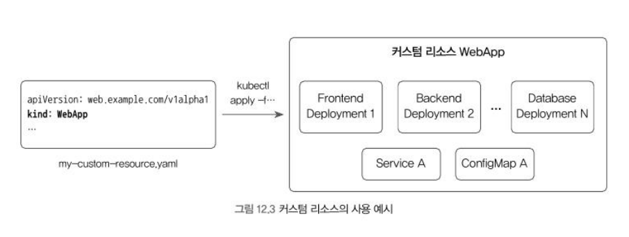

# 12 커스텀 리소스와 컨트롤러

- 쿠버 리소스
  - 포드, 디플로이먼트, 서비스 등
- 커스텀 리소스
  - 직접 리소스의 종류를 정의해 사용

## 12.1 쿠버네티스 컨트롤러의 개념과 동작 방식
* 명령형(imperative) vs 선언적(Declarative)
- docker run 과 같이 특정 명령을 처리하는 주체와 통신해 그작업을 수행하고 결과값을 돌려받는 방식을 명령형
- 쿠버네티스는 선언형을 지향
  - 최종적으로 도달해야하는 바람직한 상태(Desired State)를 정의한 뒤 현재 상태가 바람직한 상태와 다를 경우 이를 일치하도록 만드는 방법
  - 선언형 예) kubectl apply
    - -f 뒤 yaml 파일에 최종적으로 도달해야하는 상태를 의미하여 특정 동작을 수행

  ```
  $kubectl create -f completed-pop.yaml
  $kubectl create -f completed-pod.yaml
  ```
  - 위는 명령형 방식의 예로 "새로운 리소스를 생성해라"라는 구체적인 동작을 의미
    - 2번째 명령에서 이미 리소스가 존재한다는 오류를 반환할것
  - 선언형은 이와 다르게 동작하여 실제로 어떠한 동작을 취해야하는지 명시하지 않고 쿠버네티스 컨트롤러라고 불리는 개체가 내부적으로 결정하여 바람직한 상태가 되도록 만들 것

  ```
  kubectl get rs
  ```

  |name|desired|current|ready|age|
  |--|--|--|--|--|
  |minreadys-|1|1|1|4h57m|
  - desired 가 1이여서 포드가 삭제되면 레플리카셋은 바람직한 상태를 유지하기 위해 새로운 포드를 생성할 것

  ## 12.2 커스텀 리소스에 대한 개념



- 커스텀 리소스로 WebApp을 만들고 리소스에는 프런트엔드 서버, 백엔드 서버 및 서로 통신하기위한 여러 서비스 리소스가 포함될수 있으며 WebApp을 관리하는것 만으로 리소스를 한꺼번에 생성할수있다

* 커스텀 리소스를 사용하기 위한 단계
1. 현재 상태를 커스텀 리소스에 대한 바람직한 상태로 변화시킬수 있는 컨트롤러를 구현하고 실행
2. 커스텀 리소스의상세 정보를 정의하는 CRD 리소스를 생성
3. CRD에 정의된 데이터에 맞춰 커스텀 리소스를 생성
4. 1. 번에서 실행한 컨트롤러는 커스텀 리소스의 생성을 감지하고 리소스가 바람직한 상태가 되도록 적절한 작업을 수행

### 12.3 커스텀 리소스를 정의하기 위한 CRD

```
kubectl get crd
```

- 위 명령어로 리소스 확인가능
- CRD는 커스텀 리소스를 정의 하는 리소스이지 커스텀 리소스를 의미하는 것은 아님

```yaml
apiVersion: apiextensions.k8s.io/v1
kind: CustomResourceDefinition
metadata:
  name: alices.k106.com      # 1. CRD의 이름
spec:
  group: k106.com            # 2. 커스텀 리소스의 API 그룹
  scope: Namespaced          #    커스텀 리소스가 네임스페이스에 속하는지 여부
  names:
    plural: alices           # 3. 커스텀 리소스의 이름 (복수형)
    singular: alice          #    커스텀 리소스의 이름 (단수형)
    kind: Alice              #    YAML 파일 등에서 사용될 커스텀 리소스의 Kind
    shortNames: ["ac"]       #    커스텀 리소스 이름의 줄임말
  versions:
  - name: v1alpha1           #    커스텀 리소스의 API 버전
    served: true
    storage: true
    schema:
      openAPIV3Schema:       # 4. 커스텀 리소스의 데이터를 정의
        type: object
        required: ["spec"]   # 커스텀 리소스에는 반드시 "spec"이 존재해야 함
        properties:          # 커스텀 리소스에 저장될 데이터 형식을 정의
          spec:
            required: ["myvalue"]
            type: object
            properties:
              myvalue:
                type: "string"
                minimum: 1
```

1. 이름은 반드시 spen.names.plural + "." + speck.group 형태여야 함
2. 일반적으로 api 그룹/버전 형태를 사용

```yaml
apiVersion: k106.com/v1alpha1
kind: Alice
metadata:
  name: my-custom-resource
spec:
  myvalue: "This is my value"
```

- 위 CRD 설정값들을 만족하는 yaml 샘플

```bash
$kubectl apply -f my-crd-example.yaml
$kubectl get crds
name            created at
alice.k106.com  2019-09-13:T:08:20:15Z
```

- 커스텀 리소스 생성 완료
- get, describe등의 명령어도 사용 가능

## 12.4 커스텀 리소스와 컨트롤러
- CRD로 커스텀 리소스를 생성했다고 하더라도 큰 의미가 없다
- etcd에 저장된 단순한 데이터일 뿐 실제로 동작하고 있는 포드나 서비스가 아니다
- 특정동작을 수행하도록 컨트롤러를 별도로 구현해야만 의미가 있다
- 

- 직접 구현한 컨트롤러는 API서버의 watch 를 통해 새로운 커스텀 리소스가 생성됨을 감지하고 바람직한 상태가 되도록 특정 동작을 수행. 
- Reconcile: 바람직한 상태가 되도록 특정 동작을 수행하는것
- Operator 패턴: 일련의 동작을 통해 CRD를 사용 할수 있도록 컨트롤러를 구현하는 방법

# 13 포드를 사용하는 다른 오브젝트들
## 13.1 잡(jobs)
- job: 특정 동작을 수행하고 종료해야하는 작업을 위한 오브젝트
  - 특정 개수의 포드가 실행 중인 것이 아닌 포드가 실행되어 정상적으로 종료되는 것

```yaml
apiVersion: batch/v1
kind: Job
metadata:
  name: job-hello-world
spec:
  template:
    spec:
      restartPolicy: Never
      containers:
      - image: busybox
        args: ["sh", "-c", "echo Hello, World && exit 0"]
        name: job-hello-world
```

- kind 를 제외하고 단일 포드를 정의하는 야물과 별차이가 없음
- 최종적으로 도달하는 상태가 running이 아니라 completed 이기 떄문에 restartPolicy를 명시
- 잡의 세부 옵션
  - spec.completions
    - 잡이 성공했다고 여겨지려면 몇개의 포드가 성공해야하는지 설정
  - spec.parallelism
    - 동시에 생성될 포드의 개수
- 크론잡으로 잡을 주기적으로 실행하기
  - 잡을 주기적으로 실행하는 쿠버네티스 오브젝트

```yaml
apiVersion: batch/v1beta1
kind: CronJob
metadata:
  name: cronjob-example
spec:
  schedule: "*/1 * * * *"        # Job의 실행 주기
  jobTemplate:                 # 실행될 Job의 설정 내용 (spec)
    spec:
      template:
        spec:
          restartPolicy: Never
          containers:
          - name: cronjob-example
            image: busybox
            args: ["sh", "-c", "date"]
```

- schedule 주기마다 jobTemplate 설정 값을 갖는 잡을 실행한다            

## 13.2 데몬셋(DaemonSets)
- 쿠버네티스의 모든 노드에 동일한 포드를 하나씩 생성하는 오브젝트
- 로깅 모니터링 네트워킹 등을 위한 에이전트를 각 노드에 생성해야할떄 유용

```yaml
apiVersion: apps/v1
kind: DaemonSet                           # [1]
metadata:
  name: daemonset-example
spec:
  selector:
    matchLabels:
      name: my-daemonset-example         # [2.1] 포드를 생성하기 위한 셀렉터 설정
  template:
    metadata:                              # [2.2] 포드 라벨 설정
      labels:
        name: my-daemonset-example
    spec:
      tolerations:                           # [3] 마스터 노드에도 포드를 생성
      - key: node-role.kubernetes.io/master
        effect: NoSchedule
      containers:
      - name: daemonset-example
        image: busybox                      # 테스트를 위해 busybox 이미지 사용
        args: ["tail", "-f", "/dev/null"]
        resources:                           # [4] 자원 할당량을 제한
          limits:
            cpu: 100m
            memory: 200Mi
```     

1. 데몬셋임을 명시
2. 라벨 셀렉터를 통해 포드를 생성됨으로 정의
3. 포드를 기본단위로 사용하기 때문에 마스터 노드에 설정되어있는 Taint를 인식한 상태로 포드가 할당. 따라서 마스터 노드에 포드를 생성하기 위해 간단한 Toleration을 하나 설정 필수는 아님
4. 노드 에이전트 역할을 하기 떄문에 자원 부족으로 데몬셋이 중지되는것은 바람직하지 않다

* 위 야물로 데몬셋을 생성하면 쿠버네티스의 모든 노드에 포드가 생성

### 테인트(Taints)와 톨러레이션(Tolerations)
- kubectl taint를 사용하여 노드에 테인트을 추가한다.
- 톨러레이션 은 파드에 적용된다. 톨러레이션을 통해 스케줄러는 그와 일치하는 테인트가 있는 파드를 스케줄할 수 있다. 톨러레이션은 스케줄을 허용하지만 보장하지는 않는다. 스케줄러는 그 기능의 일부로서 다른 매개변수를 고려한다.

## 13.3 스테이트풀셋
- 데이터 베이스와 같이 상태를 갖는 statefull 애플리케이션을 관리하기 위해 제공
- stateless 포드는 이름을 주지않는 가축에 비유
- statefull 포드는 이름을 주는 애완동물에 비유

```yaml
apiVersion: apps/v1
kind: StatefulSet
metadata:
  name: statefulset-example
spec:
  serviceName: statefulset-service
  selector:
    matchLabels:
      name: statefulset-example
  replicas: 3
  template:
    metadata:
      labels:
        name: statefulset-example
    spec:
      containers:
      - name: statefulset-example
        image: alicek106/rr-test:echo-hostname
        ports:
        - containerPort: 80
          name: web
---
apiVersion: v1
kind: Service
metadata:
  name: statefulset-service
spec:
  ports:
    - port: 80
      name: web
  clusterIP: None
  selector:
    name: statefulset-example
```

- 위 야물로 리소스 생성 시 1개의 스테이트풀셋과(3개포드) 1개의 서비스가 생성
- spec.serviceName을 통해 이름을 입력하여 관리
- clusterIp가 None으로 정의되어있는데 이는 헤드리스 서비스라는것을 의미
  - 헤드리스 서비스의 이름은 SRV 레코드로 쓰이기 때문에 일므을 통해 포드에 접근할수있는 IP를 반환할수 있다
  
  ```bash
  kubectl run -i --tty --image busybox:1.28 debug --restart=Never --rm\
  nslookup statefulset-servcice
  ```
  
  * 스테이트풀셋과 퍼시스턴트 볼륨
  - 스테이트 풀셋도 퍼시스턴트 볼륨을 포드에 마운트해 데이터를 보관하는것이 바람직
  - 단 스테이트 풀셋의 포드가 여러개라면 포드마다 볼륨 클레임을 생성해야하는 번거로움이 존재하여 다이나믹 프로비저닝 기능을 제공

```yaml
        volumeMounts:
        - name: webserver-files
          mountPath: /var/www/html/
  volumeClaimTemplates:
  - metadata:
      name: webserver-files
```    

- volumeClaimTemplates를 사용하면 스테이트풀셋의 각 포드에 대해 퍼시스턴트 볼륨 클레임이 생성