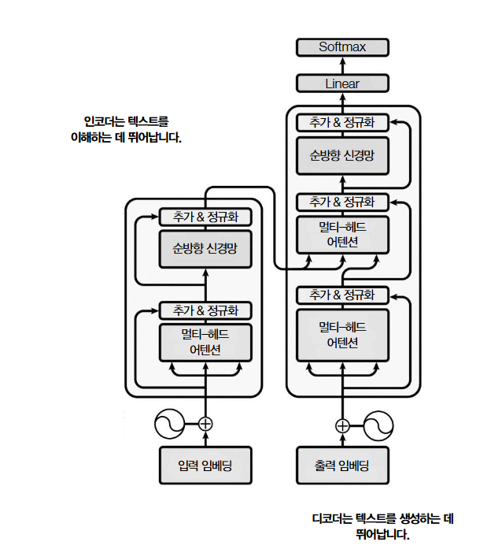
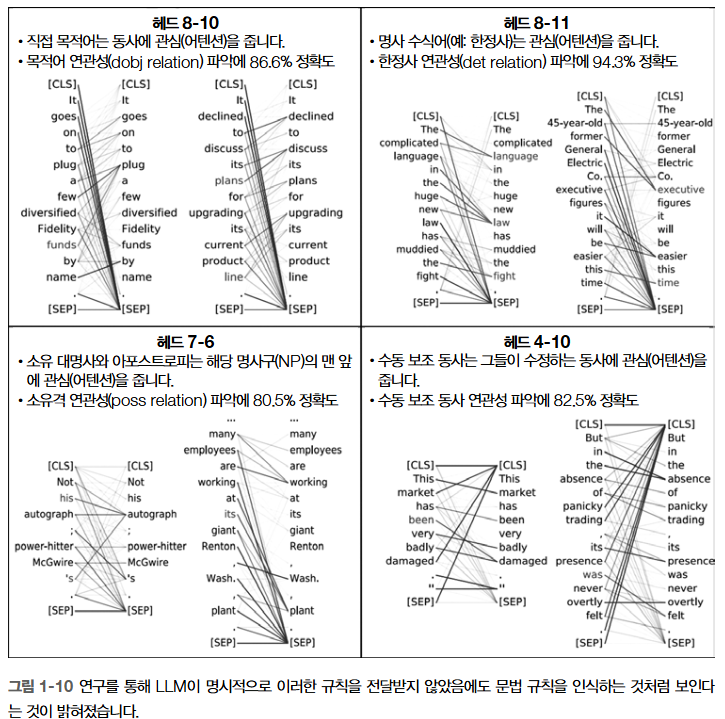
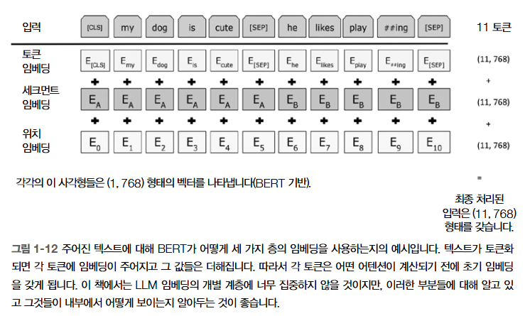
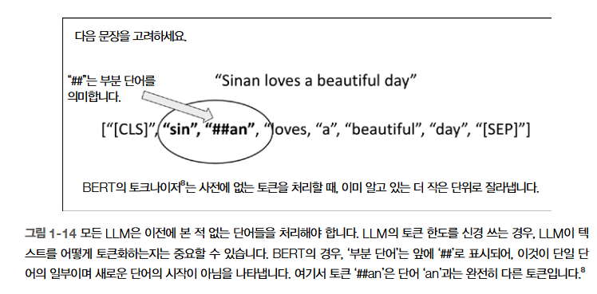
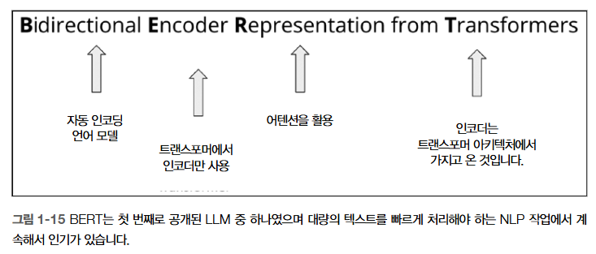
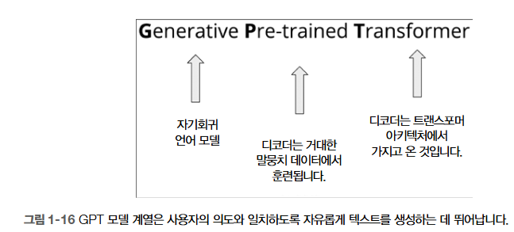
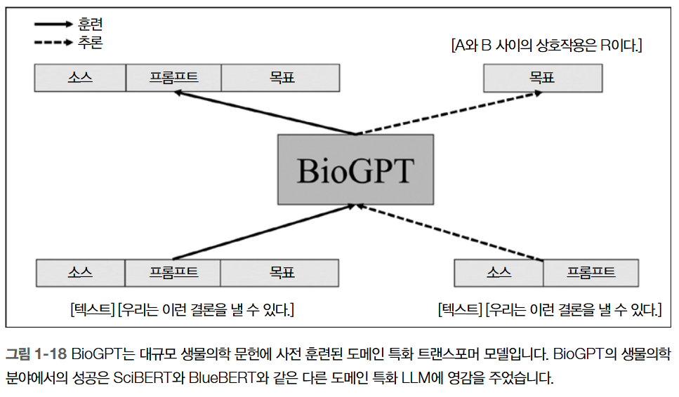

# 1 LLM
- 2017년 Google Brain 팀은 Transformer라는 진보된 인공지능 딥러닝 모델을 소개하였고 그 이후로 다양한 자연어처리(NLP: Natural Language Processing) 작업을 다루는 데 표준이 되었다.
- 이러한 트랜스포머 모델을 사용하는 다양한 모델을 의식하지 못한 채 이용하고 있었을 가능성이 높다.
- 아래는 마소와 OpenAI가 협력하여 개발한 GitHub Copilot을 이용한 소스코드이다.

```py
from transformers import pipeline
def classify_text(email):
  """
  Use facebook's BART model to classfy an email into "spam" or "not span" 
  Args:
    email str: the email to classify
  Returns:
    str: The classification of the email
  """
  # copilot 시작
    classifier = pipeline(
        "zero-shot-classification",
        model="facebook/bart-large-mnli",
        device=0,  # GPU 사용, CPU를 사용하려면 -1로 설정
        clean_up_tokenization_spaces=True,
    )
    labels = ["spam", "not spam"]
    hypothesis_template = "This email is {}."
    result = classifier(
        email, candidate_labels=labels, hypothesis_template=hypothesis_template
    )
    print(result)
    classification = result["labels"][0]
    return classification
  # copilot 끝
  
```

- 코파일럿 함수 정의와 몇몇 주석만 작성하여 동작을 수행하기 위한 모든 코드는 코파일럿이 작성함

```py
classify_text("Get a free iPhone now!")
{'sequence': 'Get a free iPhone now!', 'labels': ['not spam', 'spam'], 'scores': [0.8335405588150024, 0.16645941138267517]}
```

- 호출 가능한 다음과 같은 파이썬 함수를 만들었다

## 1.1 LLM 이란

- LLM Large language model (대규모 언어 모델)
  - 대부분 트랜스포머 아키텍처에서 파생된 AI 모델로 사람의 언어 코드 등을 이해하고 생성하기 위해 설계되었다.
  - 이러한 모델은 방대한 양의 텍스트 데이터로 학습되어 사람 언어의 복잡성과 뉘앙스를 포착할 수 있다.
    - LLM은 간단한 텍스트 분류부터 텍스트 생성에 이르기까지 언어 관련 작업을 넓은 범위에서 높은 정확도로 유창하고 유려하게 수행할 수 있다.
      - LLM은 의료 산업에서 전자 의무기록 처리, 임상시험 매칭, 신약 발견 등에 사용되며,
      - 금융 분야에서는 사기 탐지, 금융 뉴스의 감정 분석, 심지어 트레이딩 전략 등에 사용된다.
      - 챗봇과 가상 어시스턴트를 통한 고객 서비스 자동화에도 사용된다.
  - LLM과 트랜스포머의 성공은 여러 아이디어의 결합이다.
    - 어텐션, 전이 학습, 신경망의 스케일링 등 메커니즘.
    - 트랜스포머 아키텍처 자체는 매우 인상적이다.
      - 병렬화와 확장 가능.
      - 이전보다 훨씬 큰 데이터셋과 훈련 시간을 지원.
      - 트랜스포머는 시퀀스 내 각 단어가 다른 모든 단어에 주의를 기울이게 하여 단어 간의 장거리 종속성(long range dependency)과 문맥 관계를 포착할 수 있게 하는 특별한 종류의 어텐션 계산인 셀프 어텐션(self attention)을 사용.
      - Hugging Face와 같은 인기 있는 LLM 저장소가 등장하여 대중들에게 강력한 오픈 소스 모델에 대한 접근을 제공.

### 1.1.1 LLM 정의
- NLP 하위 분야로 언어 모델링(Language model)이 있다
    - 지정된 어휘(제한되고 알려진 토큰의 집합) 내의 토큰 시퀀스 가능성을 예측하기 위한 통계/딥러닝 모델의 생성을 포함
    - 일반적으로 2종류의 언어 모델링 작업이 있다(자동인코딩/자기회귀)
        - 자동인코딩(Autoencoding language model): 알려진 어휘에서 문장의 어느 부분이든 누락된 단어를 채우도록 모델에 요청(ex: 표지판에서 __ 하지 않으면 벌금을 받게 될 것입니다.(stop:95, yield: 5))
            - 손상된 버전의 입력 내용으로부터 기존 문장을 재구성하도록 훈련된다. 이러한 모델은 트랜스포머 모델의 인코더 부분에 해당하며 마스크 없이 전체 입력에 접근할 수 있다. 자동 인코딩 모델은 전체 문장의 양방향 표현을 생성. 텍스트 생성과 같은 다양한 작업에 파인튜닝 될 수 있지만 주요 애플리케이션은 문장 분류 또는 토큰 분류. BERT가 있다.
        - 자기회귀(Autoregressive language model): 알려진 어휘에서 주어진 문장의 바로 다음에 가장 가능성 있는 토큰을 생성하도록 모델에 요청한다.(ex: if you don't (mind, want, have))
            - 문장에서 이전 토큰만을 기반으로 다음 토큰을 예측하도록 훈련된다. 이러한 모델은 트랜스포머 모델의 디코더 부분에 해당하며 어텐션 헤드가 앞서 온 토큰만 볼 수 있도록 전체 문장에 마스크가 적용되어 있다. 텍스트 생성에 이상적이며 GPT가 있다.
    - 토큰: 의미를 가지는 가장 작은 단위로 문장이나 텍스트를 작은 단위로 나누어 생성. LLM의 기본 입력. 토큰은 단어일 수 있지만 하위단어(subword)일 수도 있다. n-gram이라는 용어는 n개의 연속된 시퀀스를 나타낸다
    - LLM은 자기회귀거나 자동 인코딩 또는 두 가지의 조합이 될 수 있는 언어 모델

### 1.1.2 LLM 주요 특징  



- 기존 트랜스포머 아키텍처는 시퀀스 투 시퀀스였다
- 시퀀스 투 시퀀스(sequence to sequence)(seq2seq)
  - 인코더/디코더 두 가지 구성요소를 갖는다.
  - 인코더: 원시 텍스트를 받아들여 핵심 구성 요소로 분리하고 해당 구성 요소를 벡터로 변환하는 업무를 담당하며 어텐션을 사용하여 텍스트의 맥락을 이해
  - 디코더: 수정된 형식의 어텐션을 사용하여 다음에 올 최적의 토큰을 예측함으로써 텍스트를 생성하는데 뛰어나다
- LLM의 주요 카테고리
  - GPT와 같은 자기회귀 모델 - 이전 토큰을 기반으로 문장의 다음 토큰을 예측. 주어진 맥락을 따라서 일관성 있는 텍스트를 생성하는데 효과적
  - BERT와 같은 자동 인코딩 모델 - 입력 토큰 중 일부를 가리고 남아있는 토큰으로부터 그것을 예측하여 문맥을 양방향으로 이해하여 표현을 구축한다. 토큰 간의 맥락적 관계를 빠르고 대규모로 포착하는데 능숙하여 텍스트 분류 작업에 이용하기에 좋다
  - T5와 같은 자기회귀와 자동 인코딩의 조합
    
### 1.1.3 LLM 작동원리
    
- LLM이 어떻게 사전훈련되고 파인튜닝되는지에 따라 그저 괜찮은 성능의 LLM과 매우 정확한 LLM 사이의 차이가 만들어진다.
- 사전훈련
  - 이름이 붙여진 거의 모든 LLM은 대량의 텍스트 데이터로 특정 언어 모델링 관련 작업에 대해 사전훈련(pre training) 되었다
  - MLM(masked language modeling) 마스크된 언어 모델링
    - 이스탄불은 방문하기에 훌륭한 [마스크]
  - NSP(next sentence prediction) 다음 문장 예측
    - A: 이스탄불은 방문하기에 훌륭한 도시입니다. B: 나는 거기 가봤습니다.
      - 문장 B는 A 문장의 바로 다음에 왔습니까? 예 or 아니오
  - 사전 훈련 과정은 LLM을 더 잘 훈련시키는 방법을 찾아내고 도움이 되지 않는 방법을 단계적으로 제거함에 따라 발전
- 전이학습(Transfer learning)
  - 머신러닝에서 한 작업에서 얻은 지식을 활용하여 다른 관련 작업의 성능을 향상시키는 기술
  - LLM에 대한 전이학습은 텍스트 데이터의 한 말뭉치에서 사전훈련된 LLM을 가져온다
  - 실제 작업을 위해 작업 특정 데이터로 모델의 파라미터를 업데이트함으로써 모델을 파인튜닝하는 것을 포함한다
  - 기본 아이디어는 사전 훈련된 모델이 이미 특정 언어와 언어 내 단어 간의 관계에 대한 많은 정보를 학습했으며 이 정보를 새로운 작업에서의 성능 향상 시작점으로 사용할 수 있다는 것이다.
- 파인튜닝(fine-tuning)
  - 사전 훈련된 LLM은 특정 작업을 위해 파인튜닝 될 수 있다.
  - LLM을 작업에 특화된 상대적으로 작은 크기의 데이터셋에서 훈련시켜 특정 작업을 위한 파라미터를 조정하는 것을 의미
  - 특정 도메인 및 작업에서의 성능을 크게 향상시키는 것으로 나타난다



- 어텐션(attention)
  - 트랜스포머를 처음 소개한 논문의 제목은 어텐션만 있으면 됩니다.였다
  - 다양한 가중치를 입력의 다른 부분에 할당하는 딥러닝 모델에서 사용되는 메커니즘.
  - 중요한 정보를 우선시하고 강조할 수 있다
  - LLM은 큰 말뭉치에서 사전 훈련되고 특정 작업을 위해 더 작은 데이터셋으로 파인튜닝된다. 그리고 트랜스포머가 언어 모델로서 좋은 역할을 하기 위해서는 고도의 병렬 처리가 가능해야 하며 이로 인해 더 빠른 훈련과 텍스트의 효율적인 처리가 가능해진다. 트랜스포머가 다른 딥러닝 아키텍처와 차별화되는 점은 토큰 간의 장거리 의존성과 관계를 어텐션을 사용하여 포착할 수 있는 능력이다. 다시 말해 어텐션은 트랜스포머 기반 LLM의 핵심 구성 요소이며 훈련 과정과 대상 작업 사이의 정보를 효과적으로 유지하면서 긴 텍스트 부분을 쉽게 처리할 수 있다.



- 임베딩(Embedding)
    - 고차원 공간에서의 단어, 구절 또는 토큰의 수학적 표현
    - 자연어 처리에서 임베딩은 다른 단어와의 의미와 관계를 포착하는 방식으로 단어, 구절 또는 토큰을 나타낸다



- 토큰화(Tokenization)
  - 텍스트를 가장 작은 이해 단위인 토큰으로 분해하는 과정
    - 의미를 내포한 정보 조각으로 어텐션 계산에 입력으로 사용되어 LLM이 실제로 학습하고 작동
    - 토큰은 LLM의 정적 어휘를 구성하며 항상 전체 단어를 나타내는 것은 아님
        - 예를 들어 토큰은 구두점, 개별 문자 또는 LLM이 알지 못하는 단어의 하위 단어를 의미할 수 있다
            - BERT 모델에는 특별한 CLS 토큰이 있으며 BERT는 이를 모든 입력의 첫 번째 토큰으로 자동으로 삽입
    - 전통적인 NLP에서 사용되는 불용어 제거, 어간 추출, 그리고 잘라내기와 같은 기술들은 LLM에 사용되지 않는다
        - 불용어 제거(a, an, the와 같은 문장의 필수 요소지만 문맥적으로 의미가 없는 단어 등)
    - 토큰화에는 대소문자 변환(casting)이라는 전처리 단계가 포함될 수 있다. 대소문자 변환에는 소문자 토큰화와 대소문자 구분의 두 가지 타입 존재
    - 토큰화의 예(위 그림)
        - LLM이 어휘 사전에 없는(OOV: out-of-vocabulary) 구문을 어떻게 처리하는지에 대한 것. OOV 구문은 LLM이 토큰으로 인식하지 않는 구문/단어로 더 작은 부분 단어로 나누어야 한다.
- 언어 모델링을 넘어서: 정렬 + RLHF
  - 언어 모델에서의 정렬(Alignment)은 모델이 사용자의 기대에 부합하는 입력 프롬프트에 얼마나 잘 답변할 수 있는지를 나타낸다.
  - 언어 모델을 정렬하는 포괄적인 방법 중 하나는 강화 학습(Reinforcement Learning: RL)을 훈련 과정에 포함시키는 것
- 인간 피드백 기반 강화 학습(Reinforcement Learning from Human Feedback(RLHF))
  - RLHF는 사전 훈련된 LLM을 정렬하는 데 인기 있는 방법으로 사람의 피드백을 사용하여 성능을 향상

## 1.2 현재 많이 사용되는 LLM

- BERT, GPT, T5는 각각 구글, OPENAI, google에 의해 개발된 LLM
  - 위 모델은 전부 트랜스포머를 공유하나 아키텍처 측면에서 상당한 차이가 있다



### 1.2.1 BERT

- BERT는 트랜스포머의 인코더만 사용하고 디코더를 무시하기 때문에 한 번에 하나의 토큰을 생성하는 데 중점을 둔 더 느린 LLM에 비해서 엄청나게 많은 텍스트를 매우 빠르게 처리/이해할 수 있다
- BERT 자체는 텍스트를 분류하거나 문서를 요약하지는 않지만, 하위 NLP 작업을 위한 사전 훈련된 모델로 자주 사용



### 1.2.2 GPT-4와 ChatGPT

- GPT는 어텐션 메커니즘을 사용하여 이전 토큰을 기반으로 시퀀스에서 다음 토큰을 예측하는 자기회귀 모델
- GPT 알고리즘 계열(ChatGPT, GPT-4)은 주로 텍스트 생성에 사용되며 사람이 쓴 것처럼 자연스러운 텍스트를 생성

### 1.2.3 T5

- T5는 텍스트 분류부터 텍스트 요약 및 생성에 이르기까지 여러 NLP 작업을 수행하기 위해 설계된 순수한 인코더/디코더 트랜스포머 모델
- T5는 텍스트를 처리하고 이해하는 능력과 자유롭게 텍스트를 생성하는 능력을 모두 필요로 하는 애플리케이션에 이상적
- T5의 파인튜닝 없이 여러 작업을 수행하는 능력은 파인튜닝이 없거나 효율적이고 정확하게 여러 작업을 수행하는 다재다능한 LLM의 개발을 촉진하였다(비슷한 시기가 GPT-3)



## 1.3 도메인 특화 LLM

- 특정 도메인에서 훈련된 LLM인 도메인 특화 LLM(Domain-specific LLM)은 생물학이나 금융과 같은 특정 주제 영역에서 훈련
- BioGPT: 대규모 생물의학 문헌에 사전 훈련
  - 이 모델은 AI 의료 회사인 Owkin과 Hugging Face가 협력하여 개발
- 도메인 특화 LLM의 장점은 특정 텍스트 집합에서의 훈련에 있다.

## 1.4 LLM을 이용한 애플리케이션

- 책에서는 일반적으로 세 가지 방식으로 LLM을 사용할 것
  - 사전 훈련된 LLM의 기본적인 텍스트 처리 및 생성 능력을 큰 아키텍처의 일부로 추가적인 파인튜닝 없이 사용하기
    - 예시: 사전 훈련된 BERT/GPT를 사용하여 정보 검색 시스템
  - 전이 학습을 사용하여 매우 특정한 작업 수행하기 위해 파인튜닝
  - 학습되었거나 합리적인 직관으로 수행할 수 있는 작업을 요청하기


### 1.4.1 전통적인 자연어 처리 NLP 작업
- 일반적인 NLP작업에서 LLM의 대다수 애플리케이션은 최고의 결과를 제공한다


- 텍스트 분류
  - 텍스트 조각에 레이블을 할당하는 작업
  - 흔히 긍정, 부정적 또는 중립으로 분류하는 작업
- 번역 작업
- SQL 생성
  - SQL을 언어로 간주한다면 영어를 SQL로 변환하는 것은 실제로 영어를 프랑스어로 변환하는 것과 크게 다르지 않다.

### 1.4.2 자유로운 텍스트 생성

- 많은 LLM은 생성형 AI로 불리기도 하지만 이는 환원적이고 부정확하다
- 생성이라는 단어는 머신러닝에서 차별적 모델에 대응하는 학습 방법으로서의 의미를 가지고 있다
- 블로그 포스트 계획을 요청(프롬프트)하면 결과에 동의하지 않더라도 백지상태(tabula rasa) 문제를 해결하는 데 도움을 준다

### 1.4.3 정보 검색/신경망 의미 기반 검색


- LLM은 사전 훈련 및 파인튜닝을 통해 정보를 직접 파라미터에 인코딩하지만 매번 새로운 정보로 최신 상태를 유지하는 것은 까다롭다.
- 책에서는 정보를 동적으로 최신 상태를 유지하기 위해 벡터 데이터베이스를 사용하여 우리만의 정보 검색 시스템을 설계할 것이다.

### 1.4.4 챗봇

- LLM을 사용하여 챗봇을 구축하는 방식은 의도 엔티티 및 트리 기반의 대화 흐름을 통한 전통적인 챗봇 설계 방식과는 많이 다를 것이다.
- 시스템 프롬프트, 문맥 및 페르소나로 대체될 것이다.