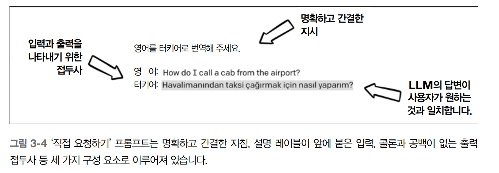
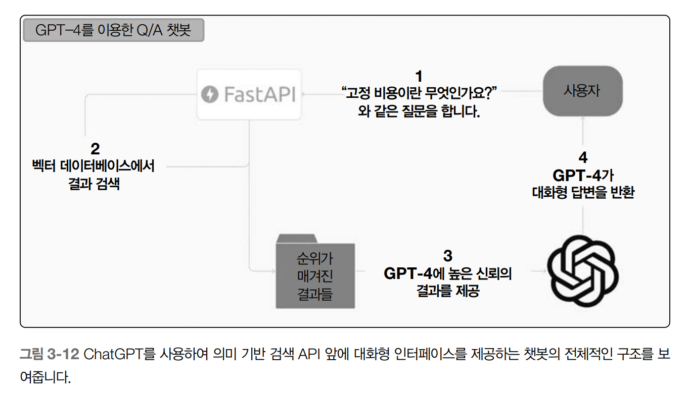

# 프롬프트 엔지니어링의 첫 번째 단계

## 3.1 들어가는 글
- 사용자 경험을 향상시키고 엔드 투 엔드 LLM기반 애플리케이션을 생서아고자 할 때 필요하다

## 3.2 프롬프트 엔지니어링(Prompt Engineering)

- 효과적으로 작업을 전달하여 정확하고 유용한 출력을 반환하도록 유도하는 LLM에 대한 입력(프롬프트)를 만드는것

### 3.2.1 언어 모델에서 정렬
- 언어 모델에서의 정렬(alignment)이란 모델이 사용자가 예상한 것과 일치하는 방식으로 입력 프롬프트를 이해하고 답변하는 것을 말한다

### 3.2.2 직접 요청하기

* Playground나 온라인 인터페이스에서 프롬프트 형식을 테스트해 보면 효과적인 접근법을 파악하는데 도움을 준다
* 최적의 출력을 얻으려면 대량의 데이터 및 코드/api로 진행하는 엄격한 테스트가 필요

- 프롬프트 엔지니어링의 첫 번째이자 가장 중요한 규칙은 요청하는 내용이 최대한 명확하고 직접적이어야 한다는 것
- LLM에 작업을 요청할 때 그작업을 가능한 한 명확하게 전달하는 것이 중요
- 문장의 문법을 수정하도록 요청하는 경우
  - "이 문장의 문법을 수정하세요" 라는 직접직인 지시만으로 명확하고 정확한 답변을 얻을 수 있다
- 간단한 직접요청하기 프롬프트는 세가지 요소로 구성된다
  - 직접적인 지시: "영어를 터키어로 번역하세요" 이것은 프롬프트 상단에 위치해야하며, LLM이 다음에 오는 입력 내용을 읽는 동안 주의를 기울일 수 있도록 한다
  - 번역을 원하는 영어 구문 앞에 "영어:"를 추가하여 명확하게 입력을 지정
  - LLM이 답변을 제공할 공간에 의도적으로 유사한 접두사 "터키어:"를 추가
- 세 가지 요소는 체계적으로 구성된 지시사항의 일부로, 구조화된 답변 영역이 포함되어 있다




### 3.2.3 퓨샷 학습(Few-shot Learning)

- 작업에 대한 깊은 이해가 필요한, 복잡한 작업의 경우, 몇가지 예제를 LLM에 제공하면 정확하고 일관된 출력을 생성하는 데 큰 도움을 준다
- 퓨샷 학습: 작업의 몇가지 예지를 제공하여 문제의 맥락과 애매한 차이를 이해하는 데 도움을 주는 강력한 기술
- 퓨샷 학습은 특정한 어조 구문 또는 스타일이 필요한 작업과 특정 도메인에 특화된 언어를 다룰 때 특히 유용


- 명시적인 지시를 제공하지 않고도 LLM에 작업 이해도를 제공할 수 있으므로 더 직관적이고 사용자 친화적인 환경을 만들 수 있다

### 3.2.4 출력 구조화

- LLM은 다양한 형식으로 텍스트를 생성할 수 있지만, 때로는 지나치게 다양한 형식으로 출력한다
- 출력을 구조화하는 것이 다른 시스템과 통합하고 작업하기 쉽게 하는데 도움된다
- 출력의 일관성을 보장하고 모델과 작업할 때 오류나 불일치의 위험을 줄인다


### 3.2.5 페르소나 지정하기

- 프로픔트에서 구체적인 단어선택은 모델의 출력에 큰 영향을 미칠 수 있다
- 프롬프트를 살짝 변경만 해도 상당히 다른 결과가 나올 수 있다
  - 예를 들어, 단어 하나를 추가하거나 제거하는 것만으로도 LLM이 초점을 바꾸거나 작업에 대한 해석을 완전히 다르게 할 수 있다
- LLM을 위한 "페르소나"를 만들어 프롬프트에 따라 모델이 스타일이나 말투를 채택할 수 있다 
- 페르소나는 특정 주제, 장르 또는 심지어 픽션 캐릭터를 기반으로 하며 특정 유형의 답변을 유도하도록 설계


- 페르소나는 항상 긍정적인 목적으로 사용되지는 않는다
- 반유대주의자의 행동을 모방하도록 요청한 것처럼 일부 사람들은 LLM을 사용하여 유해한 메시지 생성
- 유해한 말을 홍보하거나 다른 해로운 콘텐츠를 조장하는 프롬프트를 LLM에 입력함으로써 해로운 아이디어를 유지하고 부정적인 편견을 강화하는 텍스트를 생성할 수도 있다
- LLM의 개발자들은 이러한 잠재적인 오용을 완화하기 위한 조치로 콘텐츠 필터를 구현하고 관리자와 협력하여 모델의 출력을 검토하는 등의 작업한다

## 3.3 여러 모델과 프롬프트 작업하기

- 프롬프트는 언어 모델의 아키텍처와 학습에 따라 크게 달라진다
- 일부 프롬프트는 모델간에 이전될 수 있으나 다른 경우 특정모델과 작동하도록 조정하거나 재설계해야할수있다

### 3.3.1 ChatGPT

- 일부 언어 모델은 하나의 프롬프트만 받는 것이 아닌 여러 시스템, 사용자 및 어시스턴트 프롬프트를 받을 수 있다
- 대화형 모델(ChatGPT)는 시스템 프롬프트(System Prompt)와 여러 "사용자" 및 "어시스턴트" 프롬프트를 사용
- 시스템 프롬프트는 대화의 일반적인 지침을 나타내며 일반적으로 따라야 할 전반적인 규칙과 역할
- 사용자 및 어시스턴트 프롬프트는 각각 사용자와 언어 모델 간의 메시지


### 3.3.2 Cohere

- Cohere 모델의 명령어 계열들이 작동한다
- OpenAI의 대안으로 사용되는 이러한 모델은 보통 프롬프트를 다른 모델로 간단하게 옮길 수 없다
- 따라서 다른 언어 모델이 작동할 수 있도록 프롬프트를 수정해야 한다
- 영어에서 터키어로 무언가를 번역하도록 OpenAI와 Cohere에 요청시
  - Cohere 모델은 OpenAI 버전보다 조금 더 구조화된 지시사항이 필요하다 하지만 이것이 더 나쁜것은 아니며 모델에 따라 구성방법을 고려해야한다


### 3.3.3 오픈소스 프롬프트 엔지니어링

- 프롬프트 엔지니어링에 GPT-J와 FLAN-T5와 같은 오픈 소스 모델을 빠뜨릴수 없다
- 모델들을 사용할 때 프롬프트 엔지니어링은 사전 훈련과 파인튜닝을 최대한 활용하기 위한 중요한 단계
- 오픈 소스 모델은 프롬프트 엔지니어링에 대한 더 큰 유연성과 제어 기능을 제공하며 개발자가 파인튜닝 중에 프롬프트를 맞춤화하여 출력을 특정 사용 사례에 맞게 조정할 수 있다
- 예를 들어, 의료 챗봇을 개발하는 개발자는 의학 용어와 개념에 중점을 둔 프롬프트를 만들고 언어 번역 모델을 개발하는 개발자는 문법과 구문을 강조하는 프롬프트를 만들고 싶을 수 있다
- 오픈 소스 모델이 어떻게 사전 훈련되고 파인튜닝(파인튜닝을 했다면)되었는지를 파악하는 것은 매우 중요
- GPT-J: 자기회귀 언어 모델이므로 직접적인 지시 프롬프트를 대신 퓨샷 프롬프팅과 같은 기술이 더 잘 작동
- FLAN-T5: 지시적 프롬프팅을 고려하여 특별히 파인튜닝되었으므로 퓨샷 학습은 여전히 가능하지만 직접 질문하는 간단한 방식도 사용


## 3.4 ChatGPT와 Q/A 챗봇 만들기

- 2장에서 개발한 의미 검색 시스템을 사용하여 ChatGPT 간단한 Q/A 봇을 만들어본다
- API 엔드포인트1 중 하나는 자연어 질문을 받아 BoolQ 데이터셋에서 문서를 검색
- Q/A 챗봇을 만들기
  1. ChatGPT를 위한 시스템 프롬프트 디자인
  2. 새로운 사용자 메시지마다 저장된 지식에서 의미 검색
  3. 데이터베이스에서 찾은 의미를 직접 ChatGPT의 시스템 프롬프트에 삽입
  4. ChatGPT가 질문에 답변




```py
# 대화 중에 봇에 맥락을 제공하고,
# 지식 베이스의 내용으로 답변할 시스템 프롬프트를 정의하세요
SYSTEM_PROMPT = '''You are a helpful Q/A bot that can only reference material
from a knowledge base.
All context was pulled from a knowledge base.
If a user asks anything that is not "from the knowledge base," say that you cannot
answer.
'''
# ChatbotGPT class를 정의
class ChatbotGPT():
  # class의 생성자 정의
  def __init__(self, system_prompt, threshold=.8):
    # 시스템 프롬프트를 사용하여 대화 목록의 첫 번째 차례를 초기화
    # 사용자 입력과 지식 베이스 간의 유사도 점수에 대한 임계 값을 설정
    pass
  # 대화를 읽기 쉬운 형식으로 표시하는 방법을 정의
  def display_conversation(self):
    # 대화에서 각 턴 마다 반복
    # 턴의 역할과 내용을 가져와서
    # 역할과 내용을 읽기 쉬운 형식으로 출력
    pass
  # Define a method to handle the user's input
  def user_turn(self, message):
    # 사용자의 입력을 대화에 차례로 추가하기
    # 파인콘을 사용하여 지식 베이스에서 가장 잘 매칭되는 결과를 가져옵니다
    # 사용자의 입력과 문서 사이의 신뢰 점수가 임계 값을 충족하는지 확인
    # 임계 값을 충족한다면 지식 베이스에서 얻은 맥락을 시스템 프롬프트에 추가
    # OpenAI의 API를 사용하여 ChatGPT 모델로부터 답변을 생성
    # GPT-3.5 답변을 대화의 한 턴으로 추가
    # 어시스턴트의 답변을 리턴
    pass
```


## 3.5 마치며

- 언어 모델의 성능을 향상시키기 위해 프롬프트를 디자인하고 최적화하는 과정인 프롬프트 엔
지니어링은 다소 반복적이며 때로는 까다로울 수 있다
- 이 장에서 정렬, 직접 요청하기, 퓨샷 학습, 출력 구조화, 페르소나 지정하기, 그리고 여러 모델과 프롬프트 작업하기 등과 같은 프롬프트 엔지니어링을 방법에 대한 많은 팁과 요령을 보았다
- 또한, ChatGPT의 프롬프트 인터페이스를 사용하여 지난 장에서 구축한 API에 연결할 수 있는 챗봇을 만들었다
- 능숙한 프롬프트 엔지니어링과 효과적인 글쓰기 사이에는 강한 상관관계가 있다
- 잘 만들어진 프롬프트는 모델에 명확한 지시를 제공하여 원하는 답변과 밀접하게 일치하는 출력을 생성합니다. 사람이 주어진 프롬프트로부터 예상되는 출력을 이해하고 결과를 생성할 수 있을 때, 그 프롬프트가 LLM에도 잘 구조화되고 유용하다는 것을 의미
- 그러나 프롬프트가 여러 답변을 허용하거나 모호한 경우 좋지 않은 프롬프트
- 효과적인 프롬프트 작성은 전통적인 엔지니어링 작업보다는 데이터 주석 지침을 만들거나 숙련된 글쓰기에 더 가깝다
