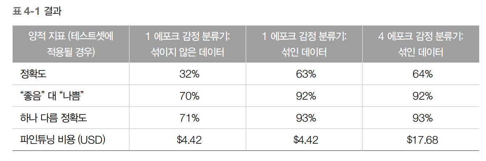

# 맞춤형 파인튜닝으로 LLM을 최적화하기

## 4.1 들어가는 글
- LLM이 가진 모든 잠재력을 활용하기 위한 파인튜닝(Fine-tuning)

## 4.2 파인튜닝과 전이학습: 기초 안내서
- 파인튜닝은 전이학습Transfer Learning을 기반으로 한다
  - 전이학습: 사전 훈련된 모델을 활용해 새로운 작업이나 분야에 기존 지식을 적용하는 기술. LLM 전이학습은 사전 훈련된 모델의 일반적인 언어 이해 능력을 특정 분야의 작업에 적용하는 것
  - 그러나 사전 훈련만으로 폐쇄적이 거나 전문화된 주제에 대한 뉘앙스를 모두 이해하기에 충분하지 않다
  

### 4.2.1 파인튜닝 과정
- 훈련셋(Training set)
  - 모델 훈련 레이블이 달린 예시 모음
  - 모델은 훈련 예시 기반으로 파라미터를 조정하여 데이터의 패턴과 관계 인식
- 검증셋(Validation set)
  - 훈련셋과 별개 
  - 훈련 중 모델의 성능을 평가 레이블 예시
- 테스트셋(Test set)
  - 훈련셋과 검증셋 모두와 별개인 레이블이 지정된 세 번째 예시 모음
  - 훈련과 파인튜닝 과정이 완료된 후 모델의 최종 성능을 평가
  - 새로운 데이터를 일반화하는 모델의 능력이 편향 최종 평가
- 손실 함수(Loss Function)
  - 모델의 예측 값과 실제 목표 값 사이의 차이 정량화 함수
  - 모델의 성능을 평가하고 최적화 과정을 안내하는 오차의 지표
  - 손실 함수를 최소화가 모델 훈련 목표

* 파인튜닝 과정


1. 레이블이 지정된 데이터 수집
  - 작업이나 도메인과 관련된 레이블이 지정된 예시 훈련, 검증, 테스트를 위한 데이터셋 수집
2. 하이퍼파라미터 선택
  - 파인튜닝은 훈련 과정에 영향을 주는 하이퍼파라미터를 조정
  - 학습률은 각 단계에서 모델의 가중치를 결정, 배치 사이즈는 단일 업데이트에 사용되는 훈련셋의 크기, 에포크 수는 모델이 전체 훈련셋을 몇 번 학습할지
  - 과적합3 (모델이 훈련 데이터의 노이즈를 신호보다 더 많이 학습하는 경우)과 과소적합4 (모델이 데이터의 기본 구조를 파악하지 못하는 경우)과 같은 문제를 방지
3. 모델 적응(adaptation)
  - 레이블이 달린 데이터와 하이퍼파라미터 설정 이후 모델을 목표 작업에 적응
  - 모델의 아키텍처를 수정해 목표 작업에 적합하게 만드는 과정
  - BERT5의 아키텍처는 그대로면 시퀀스6 분류를 수행할 수 없지만, 아주 약간 수정을 하면 시퀀스 분류를 수행  
4. 평가와 반복(iteration)
  - 홀드아웃holdout 검증7 셋으로 처음 접하는 데이터에도 잘 일반화되는지 확인
  - 정확도, F1 점수, 평균 절대 오차 Mean Absolute Error (MAE)와 같은 성능 지표를 이용
  - 성능이 만족스럽지 않다면 하이퍼파라미터나 데이터셋을 조정한 후 모델을 다시 훈련  
5. 모델 구현 및 추가 학습
  - 모델 파인튜닝 및 성능에 만족 시 기존 인프라와 통합

### 4.2.2 파운데이션 모델로 사전 훈련된 클로즈드 소스 모델 사용하기

- 파운데이션 모델Foundation Model(FM)
  - 방대한 양의 데이터를 자기 지도 학습을 통해 사전 훈련된 모델로 자신의 작업에 맞게 다목적으로 파인튜닝해서 사용할 수 있는 범용 모델
    - OpenAI의 GPT, Google의 BERT, 네이버의 하이퍼클로바 X 등
- OpenAI의 파인튜닝 인프라 사용 이점
  - GPT-4와 같은 강력한 사전 훈련 모델에 접근가능
  - 파인튜닝 과정을 단순화시킨 비교적 사용자 친화 인터페이스

## 4.3 OpenAI 파인튜닝 API 살펴보기
- GPT-3 API는 LLM 중 하나에 접근을 제공
- API는 다양한 파인튜닝 기능 제공

### 4.3.1 GPT-3 파인튜닝 API
- GPT-3 파인튜닝 API는 모델을 쉽게 맞춤화할 수 있는 강력한 기능제공

### 4.3.2 사례 연구: Amazon 리뷰 감정 분류
- 사례 연구를 소개
  - amazon_reviews_multi 데이터셋 사용
    - 데이터셋은 여러 제품 카테고리와 언어(영어, 일본어, 독일어, 프랑스어, 중국어, 스페인어)에 걸쳐 있는 Amazon의 제품 리뷰 모음
    - 데이터셋에 있는 각 리뷰는 1개에서 5개의 별로 평가
  - 이번 파인튜닝에서 데이터셋
    - review_title: 리뷰의 텍스트 제목
    - review_body: 리뷰의 텍스트 본문
    - stars: 1과 5 사이의 정수 별점


### 4.3.3 데이터에 대한 지침 및 모범 사례

- 파인튜닝 데이터를 선택 고려 사항
  - 데이터 품질: 노이즈가 없어야 하고 대상 도메인이나 작업을 정확하게 대표
  - 데이터 다양성: 데이터셋이 다양하게 구성 다양한 시나리오를 포괄하여 모델이 다른 상황
에서도 잘 일반화될 수 있어야 합니다.
  - 데이터 균형: 다양한 작업과 도메인 간의 예제 분포를 균형 있게 유지 
  - 데이터 양: 모델을 파인튜닝하기 위해 필요한 데이터의 총량 필요한 데이터의 정확한 양은 수행 중인 작업의 복잡성에 따라 달라질 수 있다 대량의 훈련 데이터 사용 시 모델 성능을 향상시킬 수 있지만 컴퓨팅 자원도 증가

## 4.4 OpenAI CLI로 맞춤형 예제 준비하기

- API 요구사항에 따라 데이터 정리 및 형식을 맞추어 데이터 준비
  - 중복 제거: 데이터셋에 중복 리뷰를 제거 모델이 특정 예제에 과적합되는 것 방지 및 새로운 데이터에 일반화하는 능력을 향상
  - 데이터 분할: 데이터셋을 훈련, 검증, 테스트셋으로 나누어, 각 셋에 예제의 무작위 분포를 유지
  - 훈련 데이터 섞기(shuffling): 파인튜닝 전 훈련 데이터를 섞는 것 의도하지 않은 패턴 학습의 위험 감소
  - OpenAI JSONL 형식 생성
    - OpenAI의 API는 훈련 데이터가 JSONLJSON Lines (개행으로 구분된 JSON) 형식으로 되었을 때 더 좋은 성능을 낸다 
    - 따라서 훈련 및 검증셋의 각 예제 prompt(입력)와 completion(타겟 클래스)이라는 두 필드를 가진 JSON 객체를 생성
      - prompt 필드에 리뷰 텍스트
      - completion 필드에는 해당 감정 레이블(별점) 저장
- 분류 레이블 앞에는 시작 공백이 있다
  - 모델이 새 토큰을 생성해야 한다는 것을 이해한다


```py

from datasets import load_dataset
import pandas as pd

# IMDb 리뷰 데이터셋을 로드
dataset = load_dataset("imdb")

# 데이터셋의 'train' 서브셋을 pandas DataFrame으로 변환
training_df = pd.DataFrame(dataset['train'])

def prepare_df_for_openai(df):
    # 'text' 열을 사용하여 'prompt' 열을 생성
    df['prompt'] = df['text'] + '\n\n###\n\n'
    # 'label' 값 앞에 공백을 추가함으로써 새로운 'completion' 열을 생성
    df['completion'] = ' ' + df['label'].astype(str)
    # 'prompt' 열을 기준으로 중복 행을 제거
    df.drop_duplicates(subset=['prompt'], inplace=True)
    # 'prompt'와 'completion' 열만 포함한 뒤섞이고 필터링된 DataFrame을 반환
    return df[['prompt', 'completion']].sample(len(df))

english_training_df = prepare_df_for_openai(training_df)

# 프롬프트와 완성을 JSONL 파일로 내보냅니다
english_training_df.to_json("imdb-train-sentiment.jsonl", orient='records', lines=True)
```
```json
{"prompt":"First of all, I apologize for my English. <br \/><br \/>Everybody from ex-Yugoslavia who isn't some extreme Serbian radical will agree with me. This movie, shows Serbian side, and only Serbian side. No Serbian crimes were represented. Luckily, everyone can see that this movie was made by Serbians, so there is no neutrality. All ''professionals'' who were interviewed are not professionals at all. Some guy only read a book written by some radical Serbian, the other one is genocide denier etc.etc.<br \/><br \/>Even Slovenians were accused in this movie.And the whole war in Slovenia lasted for few days, and only because Slovenians were lucky.There weren't many Serbs in Slovenia, and YNA couldn't reach Slovenia trough Croatia (after Croatia-Serbia war started). Every Slovenian is outraged by all accusations in this movie. <br \/><br \/>Every reasonable Croat will agree with one thing: The independence was too early. Perhaps all major conflicts could be avoided. However, mentioning WWII and some unrelated things was truly pathetic attempt to justify everything. Just imagine Japanese throwing nuclear bombs at Seattle and Washington, and saying that was justified by Hiroshima and Nagasaki. You will find no evidence about strangled YNA soldier, and murdered Serbian civilians near Vukovar. But you can find the tape with reporter committing that his claims about Serbian civilians near Vukovar were lies. All over the internet. And the director forgot to mention the whole bombing of Vukovar by YNA (now on Serbian and Montenegro side-and 100% full of Serbs and Montenegrin) And let's not start about the Chetnik movement. At the beginning, it was simply a resistance movement. But director somehow forgot to mention collaboration with the Nazis, including Ustashe, ethnic cleansing, and fighting again the Yugoslav partisans. There are thousands of other things, but all of it can be easily checked. There are many misleading things in this movie. Only few of all accusations are true. Every Croatian is outraged by this movie. <br \/><br \/>I believe that I don't need to mention Srebrenica genocide denial, the genocide that has too many evidence. Imagine the movie about holocaust denial. This movie is the same. And according to this movie Bosnian Muslims in Sarajevo bombed themselves. Every Bosnian Muslim is outraged by this movie. <br \/><br \/>Somehow director forgot to mention the short occupation of small piece of Macedonian (FYROM) land by the Serbs. <br \/><br \/>Croatians, Slovenians, Bosnians, and Macedonians never entered Serbian borders. If you are not Serbian and you actually started to believe some things from this movie, know that Serbs have some kind of propaganda that Croats, Bosnian Muslims, and Macedonians are actually Serbs who made up their history. So...<br \/><br \/>Even 50% of Serbs will say that this movie is ''little'' extreme and pro-Serbian. <br \/><br \/>And Serbian radicals are very, very pleased with this movie (there is about 40% Serbs who vote for radicals).<br \/><br \/>I think everyone understands my points in here. In this so called documentary is very little truth, and my advice to everyone is: Inform yourself before watching this movie. After that, you will only laugh at all pathetic accusations.<br \/><br \/>Watch real, neutral documentaries about death of Yugoslavia.\n\n###\n\n","completion":" 0"}
{"prompt":"Two years ago at Sundance I loved Josh Kornbluth's directing debut-Haiku Tunnel. So I was looking forward to his brother (and frequent collaborator) Jacob's, The Best Thief in the World. This is a drama about a seemingly good kid growing up in a lower-class area of New York. The movie is not without its poignant moments. But at times it is as if Kornbluth is working way too hard to state the obvious: Life can be very difficult for some people. And life isn't fair.<br \/><br \/>More subtle, and more important, is our understanding that despite all of these somewhat abhorrent cultural underpinnings and the anti-social behavior they may spawn, these characters have no shortage of goodness and humanity. We can recoil at their language and their living conditions, but we are cannot discount their intent. And in fact, their struggles to maintain a family under such adversity has a certain nobility that most of us can barely appreciate. Kornbluth grew up in this neighborhood, and his compassion for the people is evident throughout.<br \/><br \/>Having said all this, The Best Thief in the World suffers from many painful flaws (including the title). The characters aren't very believable. The writing is uneven. And the plot-line is barely discernible. And for many the most disturbing is that Kornbluth uses two young black boys mimicking gangsta rap between scenes. To each his own: But while I don't question the potential realism of this phenomenon, it pains me to see 5-year-old children mf'ing and talking about having sex with a line-up of women. It's unnecessary shock value and is a forced bit of borrowed interest.\n\n###\n\n","completion":" 0"}
```

## 4.5 OpenAI CLI 설정하기

### 4.5.1 하이퍼파라미터 선택과 최적화
- 주요 하이퍼파라미터와 정의 목록
  - 학습률Learning Rate
    - 학습률은 모델이 최적화하는 동안 수행하는 단계의 크기를 결정
    - 학습률이 작을수록 수렴 속도는 느리고 정확도가 잠재적으로 올라갈 수 있다
    - 학습률이 클수록 학습 속도는 빨라지지만 모델이 최적의 솔루션을 오버슈팅(학습률 만큼 움직이면서 최적의 값을 찾을 때, 학습률이 너무 크면 최적의 값을 그냥 지나칠 수 있다) 가능
  - 배치 크기Batch Size
    - 배치 크기는 모델 업데이트의 단일 반복에서 사용된 훈련 예제의 수
    - 배치 크기가 클수록 더 안정적인 기울기와 더 빠른 학습 속도를 얻을 수 있다
    - 반면, 배치 크기가 작을수록 모델은 더 정확하며 수렴 속도는 더 느려질 수 있다
  - 훈련 에포크Training Epoch
    - 한 번의 에포크는 전체 훈련 데이터셋을 완전히 한 번 통과
    - 에포크의 수는 모델이 데이터를 반복해서 학습하고 파라미터를 파인튜닝하는 횟수 결정
  
## 4.6 첫 번째 파인튜닝 LLM

```py
# OpenAI API로 'fine_tunes.create' 명령 실행
!openai api fine_tunes.create \
 # JSONL 형식의 훈련 데이터셋 파일을 지정
 -t "amazon-english-full-train-sentiment.jsonl" \
 # JSONL 형식의 검증 데이터셋 파일을 지정
 -v "amazon-english-full-val-sentiment.jsonl" \
 # 파인튜닝 후 분류 지표의 계산을 활성화합니다
 --compute_classification_metrics \
 # 분류를 위한 클래스의 수를 설정합니다(이 경우에는 5개)
 --classification_n_classes 5 \
 # 파인튜닝할 기본 모델을 지정합니다(가장 작은 모델인 Ada 사용)
 -m ada \
 # 훈련을 위한 에포크 수를 설정합니다(이 경우에는 1개)
 --n_epochs 1
```

### 4.6.1 정량적 지표로 파인튜닝 모델 평가하기

- 파인튜닝된 모델의 성능을 측정
  - 정확도, F1 점수, 혼란도와 같은 지표와 벤치마크를 활용



- 4배의 비용으로 정확도가 1%만 상승한다면? 
  - 산업에서는 모델이 거의 완벽해야 하며 1%의 차이도 중요
  - 더 많은 에포크가 항상 더 좋은 결과를 가져다주지 않는다
  - 증분/온라인 학습은 초기에 많은 노력이 필요하지만, 이후 추가 에포크를 멈춰야 할 지점을 찾는 데 도움을 줄 수 있으므로, 이는 장기적으로 많은 가치가 있습니다
- 파인튜닝된 모델의 훈련을 더 작은 단계로 진행해서 새로운 레이블이 지정된 데이터 포인트로 더 많은 훈련 단계/에포크로 업데이트하는 과정을 "증분 학습Incremental Learning"이라 한다

### 4.6.2 정성적 평가 기술
- 정성적 평가 기술
  - 정량적 지표와 함께 수행할 때 파인튜닝된 모델의 장점과 약점 제공


### 4.6.3 파인튜닝된 GPT-3 모델을 애플리케이션에 통합하기
- 파인튜닝된 GPT-3 모델을 애플리케이션에 통합하는 방법
  - OpenAI가 제공하는 기본 모델을 사용하는 방법과 동일
  
1. 파인튜닝된 모델 식별
  - 파인튜닝 과정을 완료한 후 모델에고유한 식별자를 받게 됩니다 'ada:ft-personal-2023-03-31-05-30-46')이후 API 호출 시 필요합니다.
2. OpenAI API 사용
  - OpenAI API를 사용하여 파인튜닝된 모델에 요청
3. 애플리케이션 로직 조정
  - 파인튜닝 모델은 다른 프롬프트 구조나 다른 출력 형식을 필요로 할 수 있기 때문에, 이러한 변형을 처리하기 위해 애플리케이션의 로직 업데이트
  - ex) 프롬프트에서 리뷰 제목과 본문을 연결하고 “\n\n###\n\n”라는 맞춤형 접미사를 추가
4. 성능 모니터링 및 평가하기
  - 파인튜닝된 모델의 성능을 지속적으로 모니터링 사용자 피드백을 수집

# 4.8 마치며
GPT-3와 같은 LLM을 파인튜닝하는 것은 특정 작업이나 도메인에서 성능을 향상시키는 효과적인 방법
