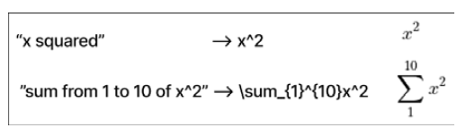

# 고급 오픈 소스 LLM 파인튜닝

## BERT를 이용한 애니메이션 장르 다중 레이블 분류

- 특성을 가지고 애니메이션의 장르 태깅

### 다중 레이블 장르 예측을 위한 성능 측정 지표로 자카드 점수 사용하기

- 예측 모델의 성능을 평가하기 위해 항목 집합 간의 유사성을 측정 지표인 자카드 점수 사용
- 항목 당 여러 레이블을 예측하는 다중 레이블 장르 예측 작업에 적합
    - 자카드 점수:  더 높은 점수는 모델의 예측이 실제 레이블과 더 유사함을 의미
    - F1점수:  데이터셋에서 모델의 정확도를 측정하는 지표. ‘긍정’ 또는 ‘부정’으로 분류하는 이진 분류 시스템을 평가하기 위해 사용됩니다. F1 점수는 정밀도(precision)와 재현율(recall)의 조화 평균이며, 1(완벽한 정밀도와 재현율)에서 0에서 최악의 값 의미
    - ROC/AUC: 수신자 조작 특성Receiver Operating Characteristic (ROC)은 확률 곡선이며, 곡선 아래 영역
    Area Under the Curve (AUC)은 분리 가능성의 정도 또는 측정치. AUC는 모델이 클래스를 얼마나 잘 구분 의미. AUC가 높을수록 모델은 0을 0으로, 1을 1로 예측하는 데 더 뛰어나다.
    - 정확도: 예측된 레이블이 실제 레이블과 정확히 일치하는 빈도를 정량화. 불균형 데이터셋의 경우, 모델이 단순히 대부분의 클래스를 예측하는 것만으로도 높은 정확도를 달성할 수 있기 때문에 오해의 소지가 있다.

### 단순 파인튜닝 과정

- 모델을 파인튜닝하기 위해 다음과 같은 구성 요소들을 설정

- 데이터셋: AnimeList 데이터셋에서 사전에 준비된 훈련 및 테스트셋 사용. 이 데이터셋은 전체 파인튜닝 과정의 기초 제공. 모델이 예측을 학습할 입력 데이터(줄거리)와 목표 레이블(장르)을 포함. 데이터셋을 훈련과 테스트셋으로 올바르게 분할하는 것은 보이지 않는 데이터에 대한 맞춤형 모델의 성능을 평가하는 데 필수적.
- 데이터 콜레이터Data Collator: 모델을 위한 입력 데이터를 처리하고 준비하는 역할. 원시 입력 데이터(예: 텍스트)를 취하여 모델이 이해할 수 있는 형식으로 변환하는 작업을 포함, 일반적으로 토큰화, 패딩, 배치 등이  해당. 입력 데이터가 올바르게 형식화되어 훈련 중인 모델에 효율적으로 공급되도록 하기 위해 데이터 콜레이터를 사용.
- TrainingArguments: Hugging Face 라이브러리가 제공하는 훈련 과정에 대한 다양한 하이퍼파라미터와 옵션을 지정하기 위한 설정 객체입니다. 여기에는 학습률, 배치 크기, 훈련 에포크 수 등이 포함됩니다. 특정 작업에 대해 최적의 성능을 달성하기 위해 TrainingArguments를 이용해서 훈련 과정을 파인튜닝할 수 있다.
- Weights & Biases: Weights & Biases (WandB)는 훈련 과정의 진행 상황을 추적하고 시
각화 라이브러리입니다. WandB를 사용해서 손실과 정확도와 같은 주요 지표를 모니터. 
- Trainer: Hugging Face 라이브러리가 제공하는 유틸리티로, 파인튜닝 과정을 관리, 데이터 로딩, 모델 가중치 업데이트, 모델 성능 평가 등의 작업 처리. Trainer를 설정함으로써 파인튜닝 과정 간소화 및 현재의 작업에 대해 모델이 효과적으로 훈련.

### 오픈 소스 LLM 파인튜닝을 위한 일반적인 팁

-  데이터 준비Data Preparation와 피처 엔지니어링FeatureEngineering의 중요성
    - 파인튜닝과 관련해서 할 수 있는 가장 쉬운 일은 원시 특성에서 새로운 복합 특성을 구성
    -  예
        - (6장): 애니메이션의 줄거리, 장르, 제작사 등을 포함하여 모델에 충분한 맥락을 제공하기 위해 ‘생성된 설명
        - (4장): 데이터 중복 제거의 중요성

    ```py
    # 필요한 라이브러리 가져오기
    from sentence_transformers import SentenceTransformer
    from sklearn.metrics.pairwise import cosine_similarity
    import numpy as np
    # 의미적으로 유사한 텍스트를 서로 가깝게 인코딩하는 모델을 초기화
    # 'paraphrase-distilroberta-base-v1'은 의미적 유사성에 대한 사전 훈련된 모델
    downsample_model = SentenceTransformer('paraphrase-distilroberta-base-v1')
    def filter_semantically_similar_texts(texts, similarity_threshold=0.8):
        # 모든 텍스트에 대한 임베딩 생성
        # 임베딩은 의미를 다차원 공간에 표현한 숫자 형태의 표현입니다
        embeddings = downsample_model.encode(texts)
        # 자기 자신과의 유사도는 언제나 1이 되므로
        # 유사도 행렬의 대각선 항목들은 0으로 설정
        np.fill_diagonal(similarity_matrix, 0)
        # 너무 유사하지 않은 텍스트들을 저장할 비어 있는 list를 초기화
        filtered_texts = []
    
        # 너무 유사한 텍스트의 인덱스들을 저장하는 set
        excluded_indices = set()
        for i, text in enumerate(texts):
            # 현재 텍스트가 다른 텍스트와 너무 유사한 것이 아니라면
            if i not in excluded_indices:
                # 유사하지 않은 텍스트 목록에 추가
                filtered_texts.append(text)
                # 현재 텍스트와 너무 유사한 텍스트들의 인덱스 검색
                similar_texts_indices = np.where(similarity_matrix[i] > similarity_threshold)[0]
                # 이 text들을 추가 고려 대상에서 제외
                excluded_indices.update(similar_texts_indices)
                
        return filtered_texts
    # 함수를 테스트하기 위한 샘플 텍스트 목록
    texts = [
    "This is a sample text.",
    "This is another sample text.",
    "This is a similar text.",
    "This is a completely different text.",
    "This text is quite alike.",
    ]
    # 의미적으로 비슷한 텍스트를 제거하기 위해서 함수 사용
    filtered_texts = filter_semantically_similar_texts(texts, similarity_threshold=0.9)
    # 의미 유사도 필터의 결과를 출력
    filtered_texts == [
    'This is a sample text.',
    'This is a similar text.',
    'This is a completely different text.',
    'This text is quite alike.'
    ]
    ```

    - 위 과정을 통해 소중한 정보를 잃을 위험이 있다는 점에 유의
    -  애니메이션이 다른 애니메이션과 의미적으로 유사하다고 해서 똑같은 장르를 가질 것이라는 의미는 아니다
        -  의미적 유사성 중복 제거Semantic Similarity Deduping는 파이프라인의 일부로 생각할 수 있으며, 비슷한 문서를 제거하기 위해 사용하는 임계 값에서 similarity_threshold 변수은 훈련 에포크 수나 학습률과 같은 하이퍼파라미터이다
- 배치 크기 및 기울기 누적 조정하기
    - 최적의 배치 크기를 찾는 것은 모델의 메모리 사용량과 안정성 사이의 균형을 맞추는 필수적인 파인튜닝 방법
    - 만약 메모리 제한이 문제라면, 기울기 누적Gradient Accumulation5은 훌륭한 해결책


- 동적 패딩Dynamic Padding
    - 전통적인 동일 길이 패딩 기술은 종종 각 시퀀스를 데이터셋 전체에서 가장 긴 시퀀스의 길이로 패딩, 시퀀스의 길이가 천차만별일 경우 계산이 많이 낭비될 수 있다. 동적 패딩은 각 배치마다 패딩의 양을 별도로 조정하므로 평균적으로 더 적은 패딩을 사용하여 계산을 더 효율적으로 만든다.
    - 동적 패딩은 대부분의 훈련 파이프라인에 추가하여 메모리 사용량과 훈련 시간을 즉각적으로 줄일 수 있는 간단한 방법

- 혼합 정밀도 훈련Mixed-Precision Training
    - GPU에서 훈련할 때 유용한 모델 훈련 과정의 효율성을 크게 향상시킬 수 있는 방법. 특히 최신 세대 GPU는 표준 32비트 형식(FP32)에 비해 낮은 정밀도(즉, 16비트 부동소수점 형식, FP16으로도 알려져 있음)에서 특정 연산을 더 빠르게 수행하도록 설계
    - 혼합 정밀도 훈련의 개념은 FP32의 수치적 안정성을 유지하면서 FP16 연산의 더 빠른 속도를 이용하기 위해 FP32와 FP16을 혼합해서 사용하는 것
    -  일반적으로, 순전파 및 역전파는 속도를 위해 FP16으로 수행되고, 가중치는 정밀도를 보존하고 언더플로underflow 및 오버플로 overflow와 같은 수치 문제를 피하기 위해 FP32로 저장

- 모델 동결
    - 사전 훈련된 모델의 파인튜닝에 대한 일반적인 접근 방식에는 모델 가중치의 동결Freezing이 포함. 이 과정에서 사전 훈련된 모델의 파라미터나 가중치는 훈련 중에 일정하게 유지(동결)되어 업데이트 X. 이는 모델이 이전 훈련에서 얻은 사전 훈련된 특징을 유지하기 위해 수행. 상위 계층은 더 복잡한, 과제에 특화된 특징을 학습. 이때 하위 계층의 가중치를 동결함으로 이러한 일반적 특징이 보존. 오직 상위 계층만이 새로운 과제에 대해 파인튜닝 한다.
    - 예:
        - BERT의 일부 또는 전체 계층을 동결하여 모델이 이미 학습한 일반적인 언어 이해를 유지할 수 있다. 그런 다음, 작업에 맞게 특수화된 몇 개의 계층만 훈련.
        - 마지막 세 계층을 제외한 모든 가중치를 동결. 그러면 BERT 모델의 마지막 세 계층 및 분류 계층과 같은 다른 추가 계층들이 업데이트되고, 다른 계층의 가중치는 유지. 이 기술은 과제에 대한 데이터셋이 작을 경우 과적합의 위험을 줄이는 특히 유용. 또한, 계산을 줄여 모델 훈련 속도도 높일 수도 있다.

    ```py
    model = AutoModelForSequenceClassification.from_pretrained(
        MODEL,
        problem_type="multi_label_classification",
        num_labels=len(unique_labels)
    )
    # 마지막 세 개의 인코딩 계층을 제외한 모든 계층을 동결
    for name, param in model.named_parameters():
        if 'distilbert.transformer.layer.4' in name:
            break
        param.requires_grad = False
    ```

    

##  예시: GPT-2를 이용한 LaTeX 생성
- LaTeX는 기술 및 과학 문서 제작을 위한 기능이 설계된 조판 시스템입니다. LaTeX는 마크업 언어일 뿐만 아니라 복잡한 수학 공식을 조판하고 텍스트의 고품질 조판을 관리하는 데 사용되는 프로그래밍 언어
    - LaTeX로의 번역을 간단한 예 50가지를 직접 작성



### 오픈 소스 모델을 위한 프롬프트 엔지니어링

- 기본 아이디어는 우리가 만든 프롬프트 형식으로 50개의 영어에서 LaTeX로 번역하는 예시를 가져와서 자기회귀 언어 모델의 표준 정의 손실, 즉 다음 토큰 예측에 대한 교차 엔트로피를 사용하여 GPT-2 모델이 이를 반복해서 (여러 에포크에 걸쳐) 읽게 하는 것입니다. 기본적으로 이것은 어휘에서 선택한 토큰을 레이블로 사용하는 분류 작업

```py
data = pd.read_csv('../data/english_to_latex.csv')
# 단일 프롬프트 추가
CONVERSION_PROMPT = 'Convert English to LaTeX\n'
CONVERSION_TOKEN = 'LaTeX:'
# GPT-2가 인식하고 학습하기를 바라는 '훈련용 프롬프트'
training_examples = f'{CONVERSION_PROMPT}English: ' + data['English'] + '\n' +
CONVERSION_TOKEN + ' ' + data['LaTeX'].astype(str)
task_df = pd.DataFrame({'text': training_examples})
# LaTeX 데이터 들어 있는 pandas DataFrame을 Hugging Face dataset으로 변환
latex_data = Dataset.from_pandas(task_df)

def preprocess(examples):
    # 여기서는 필요한 부분들을 잘라내서 텍스트를 토큰화
    # 패딩은 여기서 하지 않음. 나중에 콜레이터가 동적으로 처리
    return tokenizer(examples['text'], truncation=True)

# 전처리 함수를 LaTex 데이터셋에 적용
# map 함수는 전처리 함수를 데이터셋의 모든 예제에 적용
# 효율성을 위해 함수가 예제를 일괄 처리하도록 batched=True 옵션을 사용
latex_data = latex_data.map(preprocess, batched=True)
# 전처리 데이터셋을 훈련용과 테스트용으로 분류
# train_test_split 함수는 무작위로 예제들을 나누고 
# 80%를 훈련용으로 나머지를 테스트용으로 할당
latex_data = latex_data.train_test_split(train_size=.8)

# 먼저 LaTex 데이터를 포함하는 pandas DataFame을 Hug로 변환합니다
# DataCollatorForLanguageModeling은 예제를 일괄적으로 취합하는 데 사용됩니다
# 이는 훈련 중에 처리되는 동적 프로세스입니다.
data_collator = DataCollatorForLanguageModeling(tokenizer=tokenizer, mlm=False)
# 사전에 훈련된 버전을 사용하여 GPT-2 모델을 초기화합니다
latex_gpt2 = AutoModelForCausalLM.from_pretrained(MODEL)
# training_args를 정의합니다. 여기에는 출력을 위한 디렉토리, 훈련 에포크 수,
# 훈련 및 평가를 위한 배치 크기, 로그 수준, 평가 전략 및 저장 전략이 포함됩니다
training_args = TrainingArguments(
    output_dir="./math_english_to_latex",
    overwrite_output_dir=True,
    num_train_epochs=5,
    per_device_train_batch_size=1,
    per_device_eval_batch_size=20,
    load_best_model_at_end=True,
    log_level='info',
    evaluation_strategy='epoch',
    save_strategy='epoch'
)
# trainer를 초기화하여 GPT-2 모델, training_args, 
# 데이터셋 및 데이터 콜레이터를 전달합니다
trainer = Trainer(
    model=latex_gpt2,
    args=training_args,
    train_dataset=latex_data["train"],
    eval_dataset=latex_data["test"],
    data_collator=data_collator,
)
# 마지막으로 테스트 데이터셋을 사용하여 모델을 평가합니다.
trainer.evaluate()
```
- 변환기 사용 예

```py
loaded_model = AutoModelForCausalLM.from_pretrained('./math_english_to_latex')
latex_generator = pipeline('text-generation', model=loaded_model, tokenizer=tokenizer)
text_sample = 'g of x equals integral from 0 to 1 of x squared'
conversion_text_sample = f'{CONVERSION_PROMPT}English: {text_sample}\n{CONVERSION_ 
TOKEN}'
print(latex_generator(
 conversion_text_sample, num_beams=2, early_stopping=True, temperature=0.7,
 max_new_tokens=24
)[0]['generated_text'])
----
Convert English to LaTeX
English: g of x equals integral from 0 to 1 of x squared
LaTeX: g(x) = \int_{0}^{1} x^2 \,dx
```

## 시난의 현명하면서도 매력적인 답변 생성기: SAWYER6


1. 사전 훈련된 GPT-2를 가져와 질문에 대한 답변 개념을 이해하게 한다. 첫 번째 목표는 GPT-2 모델이 주어진 작업을 확실하게 이해하도록 하는 것. 특정 질문이나 프롬프트에 대한 답변을 제공해야 하는 것을 모델이 이해하는 과정 포함.
2. 사람이 선호하는 답변을 높게 평가하는 보상 모델을 정의. GPT-2가 주어진 작업에 대해 명확해지면, 그 성능을 평가할 수 있는 시스템을 설정. 이때 보상 모델이 등장. 이 모델은 사람의 선호와 더 일치하는 답변을 더 긍정적으로 평가하도록 설계.
3. GPT-2가 사람이 선호하는 답변을 제공하도록 유도하는 강화 학습 루프 구현. 마지막 단계는 시간이 지남에 따라 GPT-2가 개선될 수 있도록 도와주는 피드백 메커니즘을 생성. 이 피드백을 제공하기 위해 강화 학습을 사용. 모델을 사람이 더 선호하는 답변을 제공하도록 유도함으로, GPT-2의 성능을 지속적으로 향상.


- 1단계: 지시사항 파인튜닝
    - 새로운 문서 집합에서 오픈 소스 인과 모델(여기서는 GPT-2)을 파인튜닝


- 2단계: 보상 모델 훈련
    - 기본적인 지시 처리 및 답변 생성 작업을 이해할 수 있는 모델을 파인튜닝한 후, 다음 도전 과제는 그 성능을 효과적으로 평가할 수 있는 모델을 정의하는 것입니다. 머신러닝 용어로는 보상 모델로 불립니다. 이 단계에서는 이러한 보상 모델을 훈련하는 과정에 대해 논의할 것입니다. 사람들이 각 답변을 1부터 10까지 평가하며, 1은 끔찍한 답변이고 10은 훌륭한 답변. 사람이 레이블링한 데이터를 사용하여 보상 모델 아키텍처를 정의. 간단한 분류 작업으로 간주될 수 있다. 두 답변과 질문이 주어졌을 때, 어느 것이 선호되는지 분류합니다. 그러나 표준 분류 지표는 시스템이 올바른 선택을 하는 것에 대해 보상을 주는 반면, 여기서는 연속적인 보상 척도에 더 관심을 가져야 합니다. 이런 이유로, 우리는 OpenAI의 경험에서 배운 대로, 레이블이 붙은 답변에 대한 맞춤형 손실 함수를 정의
    - 맞춤형 손실 함수 정의
        - 모델을 파인튜닝할 때 맞춤형 손실 함수Custom Loss Function를 개발할 필요가 종종 있다


- 3단계: (예상하는) 사용자 피드백 기반 강화 학습

## 끊임없이 변화하는 파인튜닝의 세계

- 최근 몇 년 동안 LLM 엔지니어들의 주목을 받은 매혹적인 기술 중 하나는 PEFT LoRA
    - 파라미터 효율 파인튜닝Parmeter-Efficient Fine-Tuning (PEFT)은 LLM 내의 조정 가능한 파라미터의 수를 크게 줄여, 대부분의 사전 훈련된 가중치를 고정시키고 오직 몇 개의 추가 가중치만을 옆에 더합니다.
    - 저랭크 적응Low-Rank Adaptation (LoRA)은 PEFT에서 나온 보충 가중치를 더욱 슬림하게 만들어, 그것들 을 컴팩트한 저랭크 행렬로 분해합니다